# 前端服务监控与手写监控SDK

# 前端服务监控概述

前端监控的目的很明确，无非就是让我们的产品更完善，更符合我们和用户的需求。运营与产品团队需要关注用户在产品内的行为记录，通过用户的行为记录来优化产品，研发与测试团队则需要关注产品的性能以及异常，确保产品的性能体验以及安全迭代。

而一个完整的前端监控平台至少需要包括三个部分：**数据采集与上报、数据整理和存储、数据展示**。算上需要监控的项目的话，也就是说，至少需要4个项目才能完整的记录前端监控的内容。

下图是一个完整的前端监控平台需要处理和解决的问题：

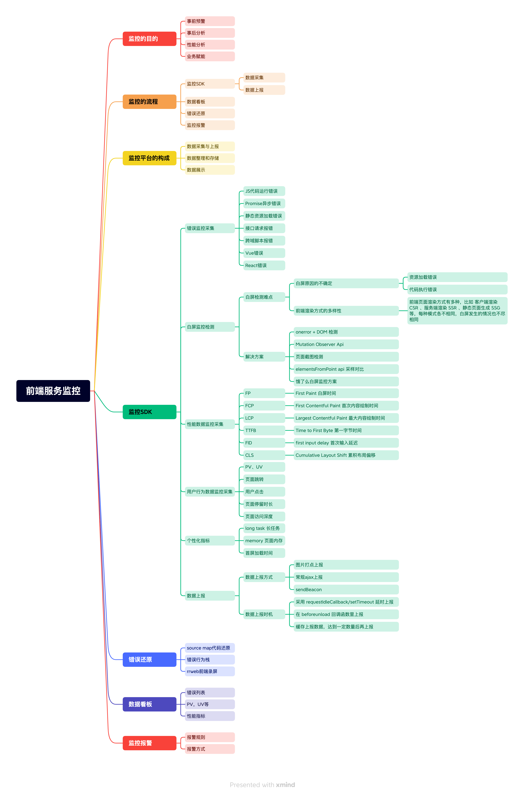

这么大一张图，估计大家看着也脑子发晕，而且这张图很多地方由于内容太多，还是省略之后的。

其实要做前端监控，很多时候，我们可以借助现成的平台去做

1、[sentry](https://sentry.io/welcome/)

2、灯塔

3、[阿里ARMS](https://www.aliyun.com/product/arms)

4、神策

......

无论如何，我们至少先看看前端监控到底在监控什么内容

## 阿里ARMS基本使用

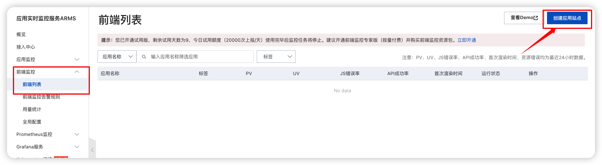

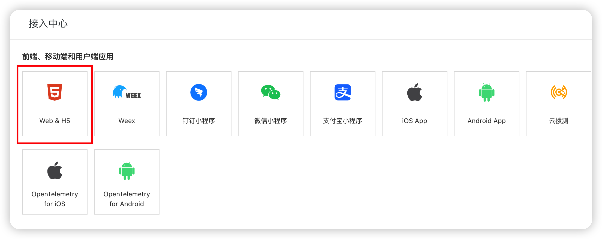

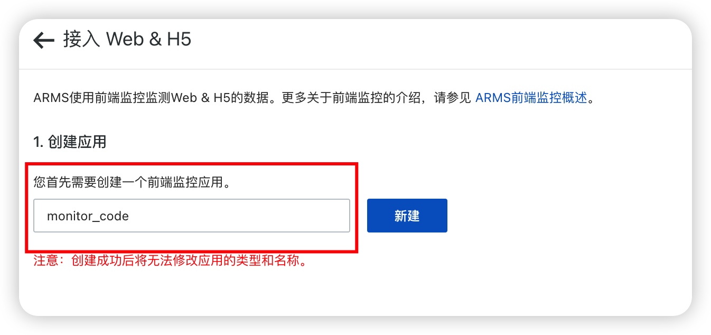

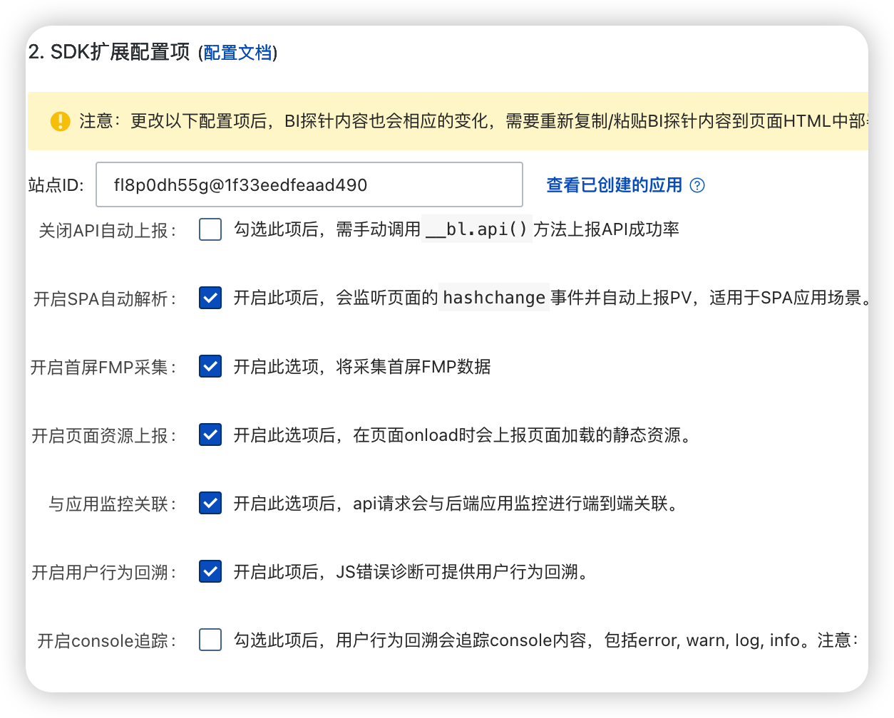

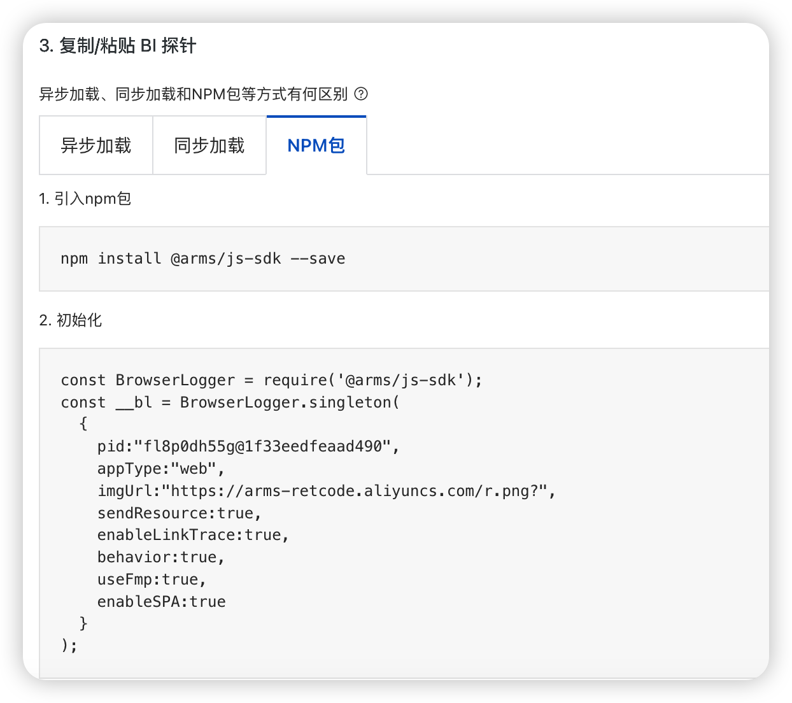

## Sentry

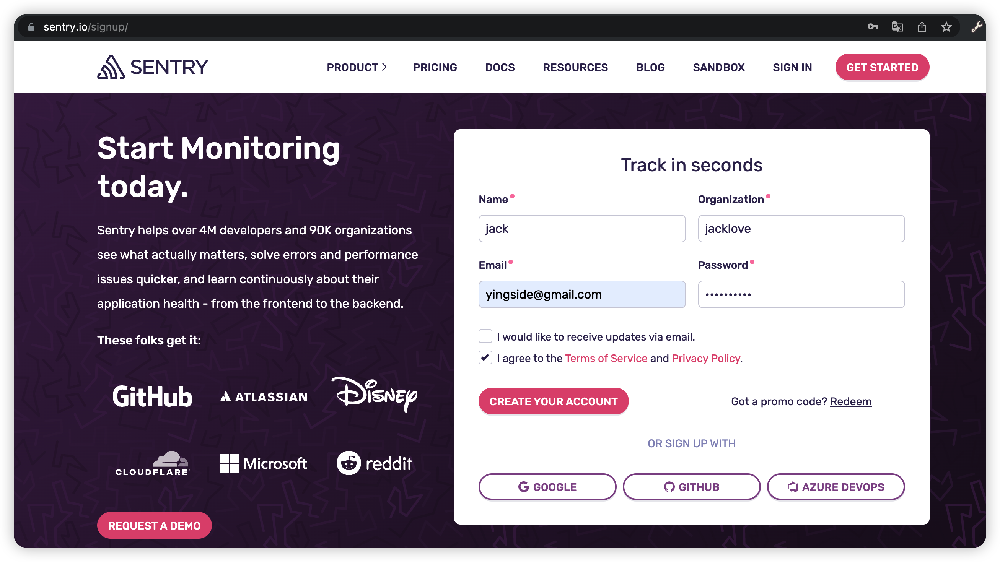

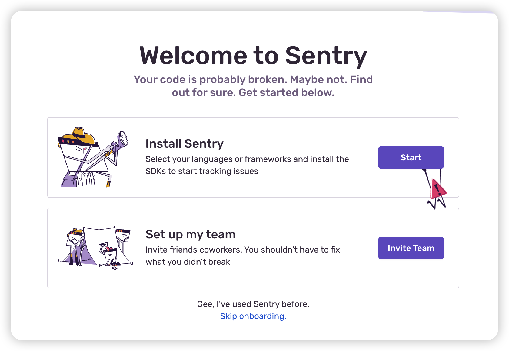

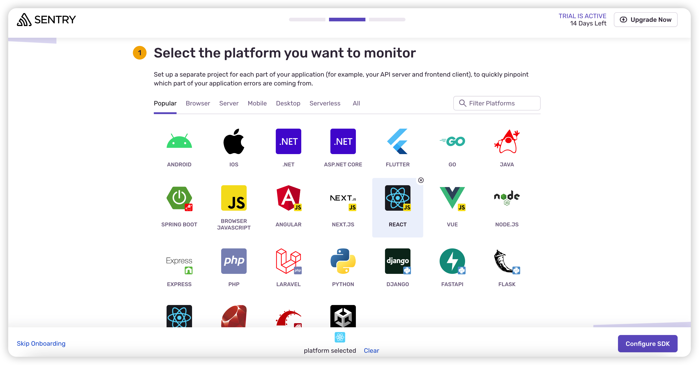

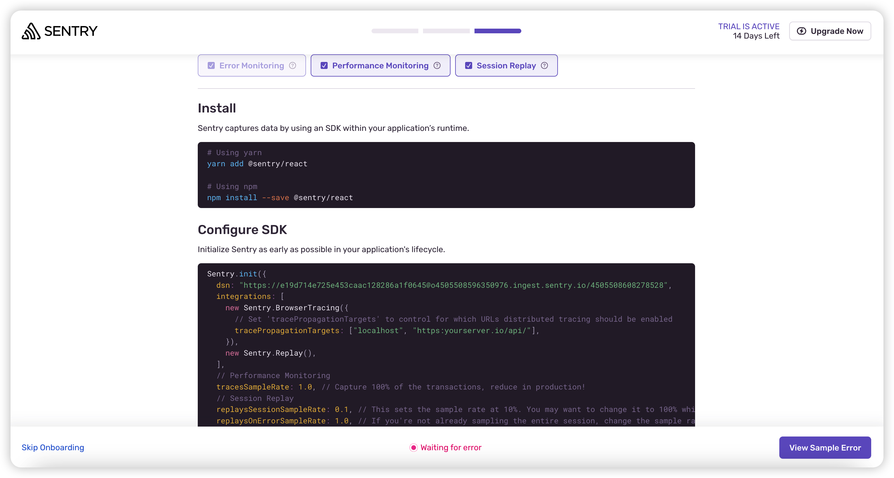

```javascript
//安装
npm install --save @sentry/react

//项目中配置SDK
import * as Sentry from "@sentry/react";
Sentry.init({
  dsn: "https://e19d714e725e453caac128286a1f0645@o4505508596350976.ingest.sentry.io/4505508608278528",
  integrations: [
    new Sentry.BrowserTracing({
      // Set 'tracePropagationTargets' to control for which URLs distributed tracing should be enabled
      tracePropagationTargets: ["localhost", "https:yourserver.io/api/"],
    }),
    new Sentry.Replay(),
  ],
  // Performance Monitoring
  tracesSampleRate: 1.0, // Capture 100% of the transactions, reduce in production!
  // Session Replay
  replaysSessionSampleRate: 0.1, // This sets the sample rate at 10%. You may want to change it to 100% while in development and then sample at a lower rate in production.
  replaysOnErrorSampleRate: 1.0, // If you're not already sampling the entire session, change the sample rate to 100% when sampling sessions where errors occur.
});

const container = document.getElementById(“app”);
const root = createRoot(container);
root.render(<App />)
```

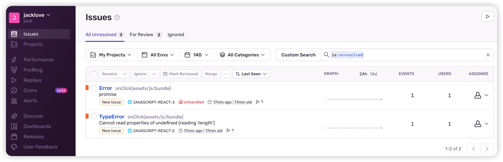

## 一些名称的解释

### 监控SDK

通过上面两个现成的框架，大家也大致能看出，我们前端监控到底是要干什么事情

- `页面的性能情况`：包括各阶段加载耗时，一些关键性的用户体验指标等

- `用户的行为情况`：包括PV、UV、访问来路，路由跳转等

- `接口的调用情况`：通过http访问的外部接口的成功率、耗时情况等

- `页面的稳定情况`：各种前端异常等

- `数据上报`：如何将监控捕获到的数据上报

其实完整的监控平台至少分为三大类

- **数据采集与上报**
- 数据整理和存储
- 数据展示

而上面总结的那一大堆，主要就是监控SDK的实现，SDK，其实就是*Software Development Kit*，其实就是提供实现监控的API

### 前端埋点

无论性能，行为还是异常情况，我们都需要在需要监控的项目代码中去监听这些内容。那么具体监听的手段其实就被称之为**前端埋点**。

前端埋点还分为**手动埋点**和**无痕埋点**。

**手动埋点**，就是在要监听的项目中的某段代码或者某个事件中加入一段监听SDK代码，然后对监听的内容进行上报，好处就是可以对关键性行为做出具体的跟踪，坏处是具有侵入性

**无痕埋点**，就是就是对监听的项目进行全部无脑监听，比如点击事件，滚动事件等等，只要触发了就上报。好处就是对代码没有侵入性，坏处当然也很明显无法快速定位关键信息，上报次数多，服务器压力大


# 错误监控

虽然在我们开发完成之后，会经历多轮的`单元测试`、`集成测试`、`人工测试`，但是**难免漏掉一些边缘的测试场景**，甚至还有一些`奇奇怪怪的玄学故障出现`；而出现报错后，`轻则某些数据页面无法访问`，`重则导致客户数据出错`；

因此，我们的前端监控，需要对前端页面的错误进行监控，一个强大完整的错误监控系统，可以帮我们做以下的事情：

- 应用报错时，及时知晓线上应用出现了错误，及时安排修复止损；
- 应用报错后，根据上报的用户行为追踪记录数据，迅速进行bug复现；
- 应用报错后，通过上报的错误行列以及错误信息，找到报错源码并快速修正；
- 数据采集后，进行分析提供宏观的 错误数、错误率、影响用户数等关键指标；


## JS运行异常

当 **JavaScript运行时产生的错误** 就属于 `JS运行异常`,比如我们常见的：

```javascript
TypeError: Cannot read properties of null
TypeError: xxx is not a function
ReferenceError: xxx is not defined
```

像这种运行时异常，我们很少手动去捕获它，当它发生异常之后，**js有两种情况都会触发它**

> **这里有一个点需要特别注意**， `SyntaxError 语法错误`，除了用 `eval()` 执行的脚本以外，一般是不可以被捕获到的。
>
> 其实原因很简单， 语法错误，在`编译解析阶段`就已经报错了，而拥有语法错误的脚本不会放入`任务队列`进行执行，**自然也就不会有错误冒泡到我们的捕获代码**。
>
> **当然，现在代码检查这么好用，早在编写代码时这种语法错误就被避免掉了，一般我们碰不上语法错误的**~

### 1、window.onerror

`window.onerror` 是一个全局变量，默认值为null。**当有js运行时错误触发时，window会触发error事件**，并执行 `window.onerror()`,借助这个特性，我们对 `window.onerror` 进行重写就可以捕获到代码中的异常

```javascript
const rawOnError = window.onerror;
// 监听 js 错误
window.onerror = (msg, url, line, column, error) => {
  //处理原有的onerror
  if (rawOnError) {
    rawOnError.call(window, msg, url, line, column, error);
  }

  console.log("监控中......");
  console.log(msg, url, line, column, error);
}
```

### 2、window.addEventListener('error')

`window.addEventListener('error')` 来捕获 `JS运行异常`；它会比 `window.onerror` **先触发**；

```javascript
window.addEventListener('error', e => {
   console.log(e);   
}, true)
```


### 两者的区别和选用

- 它们两者均可以捕获到 `JS运行异常`，但是 方法二除了可以监听 `JS运行异常` 之外，还可以同时捕获到 `静态资源加载异常`
- `onerror` 可以接受多个参数。而 `addEventListener('error')` 只有一个保存所有错误信息的参数

**更加建议使用第二种 `addEventListener('error')` 的方式**；原因很简单：`不像方法一可以被 window.onerror 重新覆盖`；`而且可以同时处理静态资源错误`

## 静态资源加载异常

界面上的`link的css`、`script的js资源`、`img图片`、`CDN资源` 打不开了，其实都会触发`window.addEventListener('error')`事件

> 使用 `addEventListener` 捕获资源错误时，一定要将 **第三个选项设为 true**，因为资源错误没有冒泡，所以只能在捕获阶段捕获。

我们只需要再事件中加入简单的判断，就可以区分是资源加载错误，还是js错误

```javascript
window.addEventListener('error', e => {
    const target = e.target;
    
    //资源加载错误
    if (target && (target.src || target.href)) {
      
    }
    else { //js错误
      
    }
    
  }, true)
```

## Promise异常

什么叫 `Promise异常` 呢？其实就是我们使用 `Promise` 的过程中，当 `Promise` 被 `reject` 且没有被 `catch` 处理的时候，就会抛出 `Promise异常`；同样的，如果我们在使用 `Promise` 的过程中，报了JS的错误，同样也被以 `Promise异常` 的形式抛出：

```javascript
Promise.resolve().then(() => console.log(c));
Promise.reject(Error('promise'))
```

而当抛出 `Promise异常` 时，会触发 `unhandledrejection` 事件，所以我们只需要去监听它就可以进行 `Promise 异常` 的捕获了，不过值得注意的一点是：**相比与上面所述的直接获取报错的行号、列号等信息**，`Promise异常` 我们只能捕获到一个 `报错原因` 而已

```javascript
window.addEventListener('unhandledrejection', e => {
    console.log("---promiseErr监控中---");
    console.error(e)    
})
```

## Vue2、Vue3 错误捕获

- `Vue2` 如果在组件渲染时出现运行错误，错误将会被传递至全局 `Vue.config.errorHandler` 配置函数；
- `Vue3` 同 `Vue2`，如果在组件渲染时出现运行错误，错误将会被传递至全局的 `app.config.errorHandler` 配置函数；

**我们可以利用这两个钩子函数来进行错误捕获**，由于是依赖于 `Vue配置函数` 的错误捕获，所以我们在`初始化`时，需要用户将 `Vue实例` 传进来；

```javascript
if (config.vue?.Vue) {
    config.vue.Vue.config.errorHandler = (e, vm, info) => {
      console.log("---vue---")
      console.log(e);
    }
  }
```


## HTTP请求异常

所谓 `Http请求异常` **也就是异步请求 HTTP 接口时的异常**，比如我调用了一个登录接口，但是我的传参不对，登录接口给我返回了 `500 错误码`，其实这个时候就已经产生了异常了.

`看到这里，其实有的同学可能会疑惑`，我们现在的调用 HTTP 接口，一般也就是通过 `async/await` 这种基于Promise的解决异步的最终方案；那么，**假如说请求了一个接口地址报了500**，因为是基于 `Promise` 调用的接口，我们**能够**在上文的 `Promise异常` 捕获中，获取到一个错误信息（如下图）；

但是有一个问题别忘记了，**`Promise异常捕获没办法获取报错的行列`**，我们**只知道** Promise 报错了，报错的信息是 `接口请求500`；但是我们**根本不知道是哪个接口报错了**；

所以说，我们对于 `Http请求异常` 的捕获需求就是：`全局统一监控`、`报错的具体接口`、`请求状态码`、`请求耗时`以及`请求参数`等等；

而为了实现上述的监控需求，我们需要了解到：现在异步请求的底层原理都是调用的 `XMLHttpRequest` 或者 `Fetch`，我们只需要对这两个方法都进行 `劫持` ，就可以往接口请求的过程中加入我们所需要的一些参数捕获；

## 跨域脚本错误

还有一种错误，平常我们较难遇到，那就是 `跨域脚本错误`,简单来说，就是你跨域调用的内容出现的错误。

> **当跨域加载的脚本中发生语法错误时，浏览器出于安全考虑，不会报告错误的细节，而只报告简单的 `Script error`。浏览器只允许同域下的脚本捕获具体错误信息，而其他脚本只知道发生了一个错误，但无法获知错误的具体内容（控制台仍然可以看到，JS脚本无法捕获）**

**其实对于三方脚本的错误，我们是否捕获都可以**，不过我们需要一点处理，**如果不需要捕获的话，就不进行上报**，如果需要捕获的话，只上报类型；

## React 错误捕获

`React` 一样也有官方提供的错误捕获，见文档：[zh-hans.reactjs.org/docs/react-…](https://link.juejin.cn/?target=https%3A%2F%2Fzh-hans.reactjs.org%2Fdocs%2Freact-component.html%23componentdidcatch)

和 `Vue` 不同的是，我们需要**自己定义一个类组件暴露给项目使用**，我这里就不具体详写了，感兴趣的同学可以自己进行补全：

```javascript
import React from 'react';
export default class ErrorBoundary extends React.Component {
  constructor(props) {
    super(props);
    this.state = { hasError: false };
  }
  componentDidCatch(error, info) {
    this.setState({ hasError: true });
    // 将component中的报错发送到后台
    // monitor为监控sdk导出的对象
    monitor && monitor.reactError(error, info);
  }
  render() {
    if (this.state.hasError) {
      return null
      // 也可以在出错的component处展示出错信息
      // return <h1>出错了!</h1>;
    }
    return this.props.children;
  }
}
```

其中 reactError() 方法在组装错误信息。：

```javascript
monitor.reactError = function (err, info) {
  report({
    type: ERROR_REACT,
    desc: err.toString(),
    stack: info.componentStack
  });
};
```


## 项目代码实战


#### 1、创建全局配置

```javascript
// config/index.js
const config = {
  appId: 'lite-tracker',
  userId: 'ys',
  reportUrl: 'http://127.0.0.1:3001/report/actions',
  vue: {
      Vue: null,
      router: null,
  },
  ua:navigator.userAgent,
}

export default config

export function setConfig(options) {
  for (const key in config) {
    if (options[key]) {
      config[key] = options[key]
    }
  }
}
```

#### 2、error


```javascript
// error/index.js
import config from '../config'
import lastCaptureEvent from '../utils/captureEvent'
import {getPaths} from "../utils/"

/**
 * 这个正则表达式用于匹配 JavaScript 错误栈中的堆栈跟踪信息中的单个条目，其中包含文件名、行号和列号等信息。
 * 具体来说，它匹配以下格式的文本：
 * at functionName (filename:lineNumber:columnNumber)
 * at filename:lineNumber:columnNumber
 * at http://example.com/filename:lineNumber:columnNumber
 * at https://example.com/filename:lineNumber:columnNumber
 */
const FULL_MATCH =
  /^\s*at (?:(.*?) ?\()?((?:file|https?|blob|chrome-extension|address|native|eval|webpack|<anonymous>|[-a-z]+:|.*bundle|\/).*?)(?::(\d+))?(?::(\d+))?\)?\s*$/i;

// 限制只追溯10个
const STACKTRACE_LIMIT = 10;

export default function error() {
  /*
  const rawOnError = window.onerror;
  // 监听 js 错误
  window.onerror = (msg, url, line, column, error) => {
    //处理原有的onerror
    if (rawOnError) {
      rawOnError.call(window, msg, url, line, column, error);
    }

    console.log("监控中......");
    console.log(msg, url, line, column);
    console.log(error);
  }
  */

  // 监听 promise 错误 缺点是获取不到列数据
  window.addEventListener('unhandledrejection', e => {
    console.log("---promiseErr监控中---");
    console.error(e)

    const lastEvent = lastCaptureEvent();
    let data = {};
    const reason = e.reason;

    if (typeof reason === 'string') {
      data.message = reason
    }
    else if (typeof reason === 'object') {
      const paths = getPaths(lastEvent);
      data.message = reason.message
      if (reason.stack) { 
        const errs = parseStackFrames(reason);
        const currentError = errs[0];
        data.filename = currentError.filename;
        data.functionName = currentError.functionName;
        data.lineno = currentError.lineno;
        data.colno = currentError.colno;
        data.stack = reason.stack;
        data.paths = paths;
        data.type = 'error';
        data.errorType = "promiseError";
      }
    }

    console.log(data);
  })

  // 捕获资源加载失败错误 js css img...
  //window.addEventListener('error',fn) 能捕获js错误，也能捕获资源加载失败错误
  //使用 addEventListener 捕获资源错误时，一定要将 第三个选项设为 true，
  //因为资源错误没有冒泡，所以只能在捕获阶段捕获。
  //同理，由于 window.onerror 是通过在冒泡阶段捕获错误，所以无法捕获资源错误。
  window.addEventListener('error', e => {
    const target = e.target;
    //注意当前并不是事件对象本身，而是error事件，因此获取不了当前点击的对象
    //我们可以利用事件传递的机制，获取最后一个捕获的对象
    const lastEvent = lastCaptureEvent();
    
    //资源加载错误
    if (target && (target.src || target.href)) {
      const paths = getPaths(target);
      const data = {
        type:'error',
        errorType: "resourceError",
        filename: target.src || target.href,
        tagName: target.tagName,
        message:`加载${target.tagName}资源失败`,
        paths:paths ? paths : 'Window',
      }
      console.log(data);
    }
    else { //js错误
      const errs = parseStackFrames(e.error);
      const currentError = errs[0];
      const paths = getPaths(lastEvent);
      const data = {
        type:'error',
        errorType: "jsError",
        filename: currentError.filename,
        functionName: currentError.functionName,
        lineno: currentError.lineno,
        colno: currentError.colno,
        message: e.message,
        stack: e.error.stack,
        paths:paths ? paths : 'Window'
      }
      console.log(data);
    }
    
  }, true)

  if (config.vue?.Vue) {
    config.vue.Vue.config.errorHandler = (e, vm, info) => {
      console.log("---vue---")

      const lastEvent = lastCaptureEvent();
      
      const paths = getPaths(lastEvent);

      const errs = parseStackFrames(e);
      const {
        filename,
        functionName,
        lineno,
        colno
      } = errs[0];

      const data = {
        type: 'error',
        errorType: "vueError",
        filename,
        functionName,
        lineno,
        colno,
        message: e.message,
        stack: e.stack,
        paths: paths ? paths : 'Window'
      }

      console.log(data);
    }
  }
}

function parseStackLine(line) {
  const lineMatch = line.match(FULL_MATCH);
  if (!lineMatch) return {};
  const filename = lineMatch[2];
  const functionName = lineMatch[1] || '';
  const lineno = parseInt(lineMatch[3], 10) || undefined;
  const colno = parseInt(lineMatch[4], 10) || undefined;
  return {
    filename,
    functionName,
    lineno,
    colno,
  };
}

// 解析错误堆栈
function parseStackFrames(error) {
  const { stack } = error;
  // 无 stack 时直接返回
  if (!stack) return [];
  const frames = [];
  for (const line of stack.split('\n').slice(1)) {
    const frame = parseStackLine(line);
    if (frame) {
      frames.push(frame);
    }
  }
  return frames.slice(0, STACKTRACE_LIMIT);
}
/**
 * 手动捕获错误
 * @param {*} error 
 * @param {*} msg 
 */
export function errorCaptured(error, msg){
  console.log(error);
  console.log(msg);
}
```

#### 3、事件处理

```javascript
// utils/captureEvent.js
let lastCaptureEvent;
['click', 'mousedown', 'keydown', 'scroll', 'mousewheel', 'mouseover'].forEach(eventType => {
  document.addEventListener(
    eventType,
    event => {
      lastCaptureEvent = event;
    },
    { capture: true, passive: true }
  )
});
export default () => { 
  return lastCaptureEvent;
}
```

#### 4、路径处理

```javascript
export const getComposePathEle = (e) => { 
  //如果存在path属性，直接返回path属性
  //e.composedPath()也能返回事件路径，但是还是有兼容性问题
  //https://developer.mozilla.org/zh-CN/docs/Web/API/Event/composedPath
  if(!e) return [];
  let pathArr = e.path || (e.composedPath && e.composedPath());
  if ((pathArr||[]).length) { 
    return pathArr;
  }

  //如果不存在，就向上遍历节点
  let target = e.target;
  const composedPath = [];

  while(target && target.parentNode) { 
    composedPath.push(target);
    target = target.parentNode;
  }
  //最后push进去document和window
  composedPath.push(document, window);

  return composedPath;
}

export const getComposePath = (e) => {
  if (!e) return [];
  const composedPathEle = getComposePathEle(e);
  const composedPath = composedPathEle.reverse().slice(2).map(ele => { 
    
    let selector = ele.tagName.toLowerCase();
    if(ele.id) { 
      selector += `#${ele.id}`;
    }
    if(ele.className) { 
      selector += `.${ele.className}`;
    }
    return selector;
  })

  return composedPath;
}

export const getPaths = (e) => {
  if (!e) return '';
  const composedPath = getComposePath(e);
  const selector = composedPath.join(' > ');
  return selector;
}
```

#### 5、index.js

```javascript
import { setConfig } from "./config"
import error, { errorCaptured } from "./error"
const monitor = {
  init(options = {}) { 
    setConfig(options);
    error();
  },
  errorCaptured
}

export default monitor
```


# 数据上报


要上报数据，最简单的当然直接使用ajax就行了，同时，为了每次上报是否出自同一次操作，我们这里为上报数据生成一个**UUID**，只要是同一次操作，生成的**UUID**始终一致。

```javascript
// utils/generateUniqueID.js
export default function generateUniqueID() {
  return `ys-${Date.now()}-${Math.floor(Math.random() * (9e12 - 1))}`
}
```

```javascript
import generateUniqueID from '../utils/generateUniqueID'
import config from '../config';

const uniqueID = generateUniqueID();

export function report(type, data) { 
  if (config.reportUrl === null) { 
    console.error('请设置上传 url 地址');
    return;
  }

  const reportData = JSON.stringify({
    id: uniqueID,
    appId: config.appId,
    userId: config.userId,
    type, //上报的类型 error/action/performance/...
    data, //上报的数据
    currentTime: Date.now(),
    currentPage: window.location.href,
    ua: config.ua
  })

  // ------ fetch 方式上报 ------
  fetch(config.reportUrl, {
    method: 'POST',
    headers: {
      'Content-Type': 'application/json'
    },
    body: reportData,
  }).then(res => {
    console.log(res);
  }).catch(err => {
    console.log(err);
  })
}
```

将report函数放入到之前的错误捕获中运行，就已经可以上报错误了。

现在看来好像没什么问题，但是其实通过ajax上报这种方式存在很大的问题。

1. **浏览器的安全策略：**由于浏览器的安全策略，Ajax 请求可能会受到同源策略限制。
2. **页面卸载时的数据上报：**如果使用异步的 XMLHttpRequest 或 fetch 发送 Ajax 请求进行数据上报，由于这些请求是异步的，可能会导致在页面卸载时尚未完成请求，从而导致数据丢失。当然，我们可以使用同步的 `XMLHttpRequest`来简单解决这个问题
3. **阻塞页面卸载：**如果在页面卸载时，当前页面仍在发送 Ajax 请求，这些请求可能会阻塞页面的卸载，导致页面无法正常关闭，从而影响用户体验。

## Navigator.sendBeacon()

[navigator.sendBeacon()](https://developer.mozilla.org/zh-CN/docs/Web/API/Navigator/sendBeacon)方法可用于通过 [HTTP POST](https://developer.mozilla.org/zh-CN/docs/Web/HTTP/Methods/POST) 将少量数据 [异步](https://developer.mozilla.org/zh-CN/docs/Glossary/Asynchronous) 传输到 Web 服务器。

它主要用于将统计数据发送到 Web 服务器，同时避免了用传统技术（如：[`XMLHttpRequest`](https://developer.mozilla.org/zh-CN/docs/Web/API/XMLHttpRequest)）发送分析数据的一些问题。

这个方法主要用于满足统计和诊断代码的需要，这些代码通常尝试在卸载（unload）文档之前向 Web 服务器发送数据。过早的发送数据可能导致错过收集数据的机会。然而，对于开发者来说保证在文档卸载期间发送数据一直是一个困难。因为用户代理通常会忽略在 [`unload`](https://developer.mozilla.org/zh-CN/docs/Web/API/Window/unload_event) 事件处理器中产生的异步 [`XMLHttpRequest`](https://developer.mozilla.org/zh-CN/docs/Web/API/XMLHttpRequest)。

过去，为了解决这个问题，统计和诊断代码通常要在

- 发起一个同步 `XMLHttpRequest` 来发送数据。
- 创建一个``元素并设置 `src`，大部分用户代理会延迟卸载（unload）文档以加载图像。
- 创建一个几秒的 no-op 循环。

上述的所有方法都会迫使用户代理延迟卸载文档，并使得下一个导航出现的更晚。下一个页面对于这种较差的载入表现无能为力。

这就是 **`sendBeacon()`** 方法存在的意义。使用 **`sendBeacon()`** 方法会使用户代理在有机会时异步地向服务器发送数据，同时不会延迟页面的卸载或影响下一导航的载入性能，这意味着：

- 数据发送是可靠的。
- 数据异步传输。
- 不影响下一导航的载入。

### 语法

```
navigator.sendBeacon(url);
navigator.sendBeacon(url, data);
```

### 参数

- `url`

  `url` 参数表明 `data` 将要被发送到的网络地址。

- `data` 可选

  `data` 参数是将要发送的 [`ArrayBuffer`](https://developer.mozilla.org/zh-CN/docs/Web/JavaScript/Reference/Global_Objects/ArrayBuffer)、[`ArrayBufferView`](https://developer.mozilla.org/zh-CN/docs/Web/JavaScript/Reference/Global_Objects/TypedArray)、[`Blob`](https://developer.mozilla.org/zh-CN/docs/Web/API/Blob)、[`DOMString`](https://developer.mozilla.org/zh-CN/docs/Web/JavaScript/Reference/Global_Objects/String)、[`FormData`](https://developer.mozilla.org/zh-CN/docs/Web/API/FormData) 或 [`URLSearchParams`](https://developer.mozilla.org/zh-CN/docs/Web/API/URLSearchParams) 类型的数据。

### 返回值

当用户代理成功把数据加入传输队列时，**`sendBeacon()`** 方法将会返回 `true`，否则返回 `false`。


```javascript
import generateUniqueID from '../utils/generateUniqueID'
import config from '../config';

const uniqueID = generateUniqueID();

export function report(type, data) { 
  if (config.reportUrl === null) { 
    console.error('请设置上传 url 地址');
    return;
  }

  const reportData = JSON.stringify({
    id: uniqueID,
    appId: config.appId,
    userId: config.userId,
    type, //上报的类型 error/action/performance/...
    data, //上报的数据
    currentTime: Date.now(),
    currentPage: window.location.href,
    ua: config.ua
  });

  sendBeacon(config.reportUrl, reportData);
}

// ------ navigator.sendBeacon 方式上报 ------
function sendBeacon(reportUrl, reportData) {
  if (navigator.sendBeacon) {
    navigator.sendBeacon(reportUrl, reportData);
  } else {
    reportWithXHR(reportUrl, reportData);
  }
}

// ------ XMLHttpRequest 方式上报 ------
function reportWithXHR(reportUrl,reportData) {
  const xhr = new XMLHttpRequest()
  xhr.open('POST', reportUrl, true)
  xhr.send(reportData)
}
```

## requestIdleCallback

[window.requestIdleCallback()](https://developer.mozilla.org/zh-CN/docs/Web/API/Window/requestIdleCallback)方法插入一个函数，这个函数将在浏览器空闲时期被调用

要弄懂`requestIdleCallback`函数，其实最主要的是要清楚，**浏览器在一帧里面做了什么？**

### 帧

由于现在广泛使用的屏幕都有固定的刷新率（比如最新的一般在 60Hz）， 在两次硬件刷新之间浏览器进行两次重绘是没有意义的只会消耗性能。 浏览器会利用这个间隔 16ms（1000ms/60）适当地对绘制进行节流， 因此 16ms 就成为页面渲染优化的一个关键时间。在这段时间内，浏览器需要完成如下事情：

- 脚本执行（JavaScript）：脚本造成了需要重绘的改动，比如增删 DOM、请求动画等
- 样式计算（CSS Object Model）：级联地生成每个节点的生效样式。
- 布局（Layout）：计算布局，执行渲染算法
- 重绘（Paint）：各层分别进行绘制
- 合成（Composite）：合成各层的渲染结果

### 一帧里事件执行顺序

- 用户事件
  - 阻塞输入事件，如`wheel`、`touch`等。
  - 非阻塞输入事件，如`click`、`keypress`等。
- 宏任务 + 微任务
  - 先执行宏任务。
  - 每个宏任务执行完后，会执行宏任务中产生的微任务。
  - 如果微任务中还有微任务，那么添加到微任务队列后，继续执行微任务。
  - 微任务执行完成后，可能会继续执行另一个宏任务（一帧里可以执行多个宏任务），也可能进入后续渲染阶段。
- begin frame
  - window.resize
  - scroll
  - mediaquery changed （媒体查询）
  - animation events （动画事件）
- requestAnimationFrame回调（在每次渲染之前执行，丢帧时不执行）
- 浏览器渲染过程
  - 样式计算
  - 布局
  - 重绘
  - 合成
- requestIdleCallback回调（空闲时间）

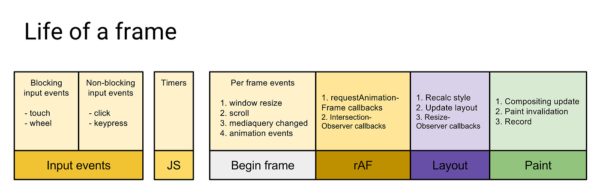

我们上传数据，也可以利用这一点，更好的处理上传时机

```javascript
export function report(type, data, isImmediate = false) { 
 	//其他代码省略......
  // 立即上传
  if (isImmediate) {
    sendBeacon(config.reportUrl, reportData)
    return
  }

  // ------ requestIdleCallback 方式上报 ------
  if (window.requestIdleCallback) {
      window.requestIdleCallback(() => {
          sendBeacon(config.reportUrl, reportData)
      }, { timeout: 3000 })
  } else {
      setTimeout(() => {
          sendBeacon(config.reportUrl, reportData)
      })
  }
}
```

## 延迟上报

还有一种情况，如果大量的问题需要上传，比如用户疯狂点击出现错误情况，那么每次上报这种情况也不太好，因此做一下延迟上报处理，也很有必要。

```javascript
// utils/cache.js
const cache = new Map();

export function getCache() {
  return cache;
}

export function addCache(type,data) {
  cache.get(type) ? cache.get(type).push(data) : cache.set(type, [data]);
}

export function clearCache() {
  cache.clear()
}
```


```javascript
// report/index.js
//其他代码省略
let timer = null

export function lazyReportCache(type, data, timeout = 3000) {
  console.log(data);
  addCache(type, data)

  clearTimeout(timer)
  timer = setTimeout(() => {
    const dataMap = getCache()

    if (dataMap.size) {
      for (const [type,data] of dataMap) {
        console.log(`${type},${data}`);
        report(type, data)
      }
      
      clearCache()
    }
  }, timeout)
}
```

然后直接将之前`report`的调用换成`lazyReportCache`调用，当然，后端的代码还需要修改，因为现在提交的都是数组了

## 图片打点上报的方式

其实除了传统的ajax方式，以及`Navigator.sendBeacon()`方式，还可以采用图片打点上报的方式。

这种方式可以避免页面切换阻塞的问题，但是缺点也很明显：

1、由于是url地址传值，所以传值的数据长度有限

2、地址传递需要后端单独做处理

```javascript
let oImage = new Image();
oImage.src = `${url}?logs=${data}`;
```


# 页面性能监控

我们都听说过性能的重要性。但当我们谈起性能，以及让网站"速度提升"时，我们具体指的是什么？

`其实性能是相对的`：

- 某个网站可能对一个用户来说速度很快（网速快，设备强大的情况下），但可能对另一个用户来说速度很慢（网速慢，设备低端的情况下）。
- 两个网站完成加载所需的时间或许相同，但其中一个却 **显得** 加载速度更快（如果该网站逐步加载内容，而不是等到最后才一起显示）。
- 一个网站可能 **看起来** 加载速度很快，但随后对用户交互的响应速度却很慢（或根本无响应）。

因此，在谈论性能时，重要的是做到精确，并且根据能够进行定量测量的客观标准来论及性能。这些标准就是 **指标**。

**`前端性能监控，就是要监测页面的性能情况，将各种的性能数据指标量化并收集`**


## Lighthouse灯塔

**Lighthouse** 是一个网站性能测评工具， 它是 Google Chrome 推出的一个开源自动化工具。能够对网页多方面的效果指标进行评测，并给出最佳实践的建议以帮助开发者改进网站的质量。它的使用方法也非常简单，我们只需要提供一个要测评的网址，它将针对此页面运行一系列的测试，然后生成一个有关页面性能的报告。通过报告我们就可以知道需要采取哪些措施来改进应用的性能和体验。

在高版本（ >= 60）的 Chrome 浏览器中，**Lighthouse** 已经直接集成到了调试工具 **DevTools**中了，因此不需要进行任何安装或下载。

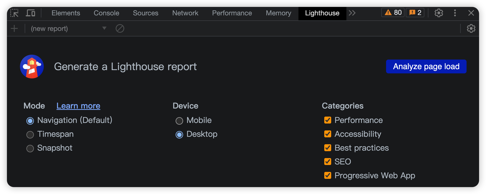

**Lighthouse 能够生成一份该网站的报告，比如下图：**

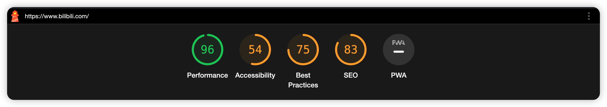

**这里重点关注`Performance性能评分`**

性能评分的分值区间是 0 到 100，如果出现 0 分，通常是在运行 Lighthouse 时发生了错误，满分 100 分代表了网站已经达到了 98 分位值的数据，而 50 分则对应 75 分位值的数据

#### Lighthouse 给出 Opportunities 优化建议

Lighthouse 会针对当前网站，给出一些`Opportunities`优化建议

**Opportunities 指的是优化机会，它提供了详细的建议和文档，来解释低分的原因，帮助我们具体进行实现和改进**


**Opportunities 给出优化建议列表**

| 问题                             | 建议                                                  |
| -------------------------------- | ----------------------------------------------------- |
| Remove unused JavaScript         | 去掉无用 js 代码                                      |
| Preload key requests             | 首页资源 preload 预加载                               |
| Remove unused CSS                | 去掉无用 css 代码                                     |
| Serve images in next-gen formats | 使用新的图片格式，比如 webp 相对 png jpg 格式体积更小 |
| Efficiently encode images        | 比如压缩图片大小                                      |
| Preconnect to required origins   | 使用 preconnect or dns-prefetch DNS 预解析            |

#### Lighthouse 给出 Diagnostics 诊断问题列表

**`Diagnostics` 指的是现在存在的问题，为进一步改善性能的验证和调整给出了指导**

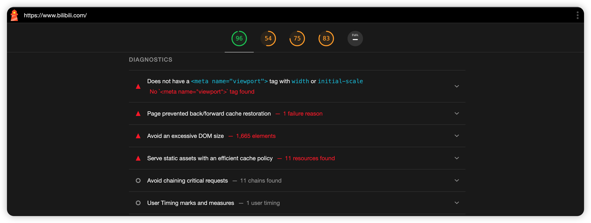

**Diagnostics 诊断问题列表**

| 问题                                                         | 影响                                                         |
| ------------------------------------------------------------ | ------------------------------------------------------------ |
| A long cache lifetime can speed up repeat visits to your page | 这些资源需要提供长的缓存期，现发现图片都是用的协商缓存，显然不合理 |
| Image elements do not have explicit width and height         | 给图片设置具体的宽高，减少 cls 的值                          |
| Avoid enormous network payloads                              | 资源太大增加网络负载                                         |
| Minimize main-thread work                                    | 最小化主线程 这里会执行解析 Html、样式计算、布局、绘制、合成等动作 |
| Reduce JavaScript execution time                             | 减少非必要 js 资源的加载，减少必要 js 资源的大小             |
| Avoid large layout shifts                                    | 避免大的布局变化，从中可以看到影响布局变化最大的元素         |


## Performance 寻找性能瓶颈

打开 Chrome 浏览器控制台，选择`Performance`选项，点击左侧`reload图标`

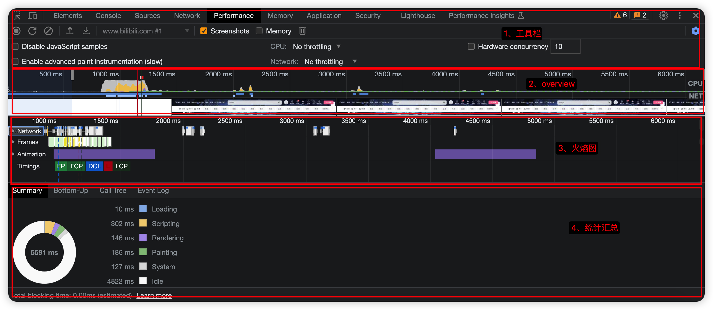

## W3C标准化

官方地址：[Navigation Timing Level 2](https://www.w3.org/TR/navigation-timing-2/)

为了帮助开发者更好地衡量和改进前端页面性能，`W3C性能小组`引入了 `Navigation Timing API` ，实现了自动、精准的页面性能打点；开发者可以通过 `window.performance` 属性获取。


`图中指标的解读`可以在 [developer.mozilla.org/zh-CN/docs/…](https://developer.mozilla.org/zh-CN/docs/Web/API/PerformanceTiming) 中查看

| 时间                       | 作用                                                         |
| -------------------------- | ------------------------------------------------------------ |
| `navigationStart`          | （可以理解为该页面的起始时间）同一个浏览器上下文的上一个文档卸载结束时的时间戳，如果没有上一个文档，这个值会和 fetchStart 相同 |
| unloadEventStart           | unload 事件抛出时的时间戳,如果没有上一个文档，这个值会是 0   |
| unloadEventEnd             | unload 事件处理完成的时间戳,如果没有上一个文档，这个值会是 0 |
| redirectStart              | 第一个 HTTP 重定向开始时的时间戳，没有重定向或者重定向中的不同源，这个值会是 0 |
| redirectEnd                | 最后一个 HTTP 重定向开始时的时间戳，没有重定向或者重定向中的不同源，这个值会是 0 |
| fetchStart                 | 浏览器准备好使用 HTTP 请求来获取文档的时间戳。发送在检查缓存之前 |
| domainLookupStart          | 域名查询开始的时间戳，如果使用了持续连接或者缓存，则与 fetchStart 一致 |
| domainLookupEnd            | 域名查询结束的时间戳，如果使用了持续连接或者缓存，则与 fetchStart 一致 |
| connectStart               | HTTP 请求开始向服务器发送时的时间戳，如果使用了持续连接，则与 fetchStart 一致 |
| connectEnd                 | 浏览器与服务器之间连接建立（所有握手和认证过程全部结束）的时间戳，如果使用了持续连接，则与 fetchStart 一致 |
| secureConnectionStart      | 浏览器与服务器开始安全连接握手时的时间戳，如果当前网页不需要安全连接，这个值会是 0 |
| `requestStart`             | 浏览器向服务器发出 HTTP 请求的时间戳                         |
| `responseStart`            | 浏览器从服务器收到（或从本地缓存读取）第一个字节时的时间戳   |
| responseEnd                | 浏览器从服务器收到（或从本地缓存读取）最后一个字节时（如果在此之前 HTTP 连接已经关闭，则返回关闭时）的时间戳 |
| `domLoading`               | 当前网页 DOM 结构开始解析时的时间戳                          |
| domInteractive             | 当前网页 DOM 结构解析完成，开始加载内嵌资源时的时间戳        |
| domContentLoadedEventStart | 需要被执行的脚本已经被解析的时间戳                           |
| domContentLoadedEventEnd   | 需要立即执行的脚本已经被执行的时间戳                         |
| `domComplete`              | 当前文档解析完成的时间戳                                     |
| loadEventStart             | load 事件被发送时的时间戳，如果这个事件还未被发送，它的值将会是 0 |
| `loadEventEnd`             | load 事件结束时的时间戳，如果这个事件还未被发送，它的值将会是 0 |


我们可以通过`performance API` 获取下面的内容

```javascript
export default function performance() {

  const {
    fetchStart,
    connectStart,
    connectEnd,
    requestStart,
    responseStart,
    responseEnd,
    domLoading,
    domInteractive,
    domContentLoadedEventStart,
    domContentLoadedEventEnd,
    loadEventStart,
    domainLookupStart,
    domainLookupEnd,
    navigationStart
  } = window.performance.timing;
  console.log(fetchStart,
    connectStart,
    connectEnd,
    requestStart,
    responseStart,
    responseEnd,
    domLoading,
    domInteractive,
    domContentLoadedEventStart,
    domContentLoadedEventEnd,
    loadEventStart,
    domainLookupStart,
    domainLookupEnd,
    navigationStart)
  
  const tcp = connectEnd - connectStart; // TCP连接耗时
  const dns = domainLookupEnd - domainLookupStart; // dns 解析时长
  const ttfbTime = responseStart - requestStart; // 首字节到达时间
  const responseTime = responseEnd - responseStart; // response响应耗时
  const parseDOMTime = loadEventStart - domLoading; // DOM解析渲染的时间
  const domContentLoadedTime = domContentLoadedEventEnd - domContentLoadedEventStart; // DOMContentLoaded事件回调耗时
  const timeToInteractive = domInteractive - fetchStart; // 首次可交互时间
  const loadTime = loadEventStart - fetchStart; // 完整的加载时间
  const whiteScreen = domLoading - navigationStart; // 白屏时间
  

  console.log(tcp,dns,ttfbTime,responseTime,parseDOMTime,domContentLoadedTime,timeToInteractive,loadTime,whiteScreen)
}

```

一大堆的变量和不知道的计算规则，你不用纠结这一堆，因为**已经被废弃了**。

**w3c level2** 扩充了 `performance` 的定义，并增加了 `PerformanceObserver` 的支持。

## [PerformanceObserver](https://developer.mozilla.org/zh-CN/docs/Web/API/PerformanceObserver)

**`PerformanceObserver`** 用于*监测*性能度量事件，在浏览器的性能时间轴记录新的 [performance entry](https://developer.mozilla.org/zh-CN/docs/Web/API/PerformanceEntry) 的时候将会被通知。

简单来说，我们只需要指定预定的[entryType](https://developer.mozilla.org/zh-CN/docs/Web/API/PerformanceEntry/entryType)，然后就能通过PerformanceObserver的回调函数获取相应的性能指标数值

```javascript
new PerformanceObserver((entryList) => {
  for (const entry of entryList.getEntriesByName('first-contentful-paint')) {
    console.log('FCP candidate:', entry.startTime, entry);
  }
}).observe({type: 'paint', buffered: true});
```

那么关键点来了，性能指标到底有些啥，每个性能指标有什么作用？

w3c制定了一大堆指标，不过google发布了`web-vitals` ，它是一个开源的用以衡量性能和用户体验的工具，对于我们现在来说，这个开源工具中所提到的指标已经足够用了。而且现在本身也是业界标准

## [web-vitals](https://web.dev/metrics/)

### [以用户为中心的性能指标](https://web.dev/user-centric-performance-metrics/)

什么叫以用户为中心的性能指标呢？其实就是可以直接的体现出用户的使用体验的指标；目前 `Google` 定义了`FCP`、`LCP`、`CLS` 等体验指标，

对于用户体验来说，指标可以简单归纳为 `加载速度`、`视觉稳定`、`交互延迟`等几个方面；

- `加载速度` 决定了 **用户是否可以尽早感受到页面已经加载完成**
- `视觉稳定` 衡量了 **页面上的视觉变化对用户造成的负面影响大小**
- `交互延迟` 决定了 **用户是否可以尽早感受到页面已经可以操作**

### [什么是 FCP？](https://web.dev/fcp/)

首次内容绘制 (FCP) 指标测量页面从开始加载到页面内容的任何部分在屏幕上完成渲染的时间。对于该指标，"内容"指的是文本、图像（包括背景图像）、`<svg>`元素或非白色的`<canvas>`元素。

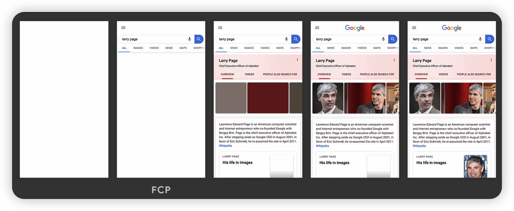

在上方的加载时间轴中，FCP 发生在第二帧，因为那是首批文本和图像元素在屏幕上完成渲染的时间点。

您会注意到，虽然部分内容已完成渲染，但并非所有内容都已经完成渲染。这是*首次*内容绘制 (FCP) 与*Largest Contentful Paint 最大内容绘制 (LCP)*（旨在测量页面的主要内容何时完成加载）之间的重要区别。

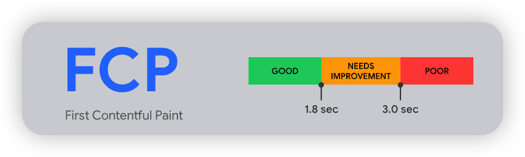

#### 怎样算是良好的 FCP 分数？

为了提供良好的用户体验，网站应该努力将首次内容绘制控制在**1.8 秒**或以内。为了确保您能够在大部分用户的访问期间达成建议目标值，一个良好的测量阈值为页面加载的**第 75 个百分位数**，且该阈值同时适用于移动和桌面设备。

### [什么是 LCP？](https://web.dev/lcp/)

最大内容绘制 (LCP) 指标会根据页面[首次开始加载](https://w3c.github.io/hr-time/#timeorigin-attribute)的时间点来报告可视区域内可见的最大[图像或文本块](https://web.dev/lcp/#what-elements-are-considered)完成渲染的相对时间。

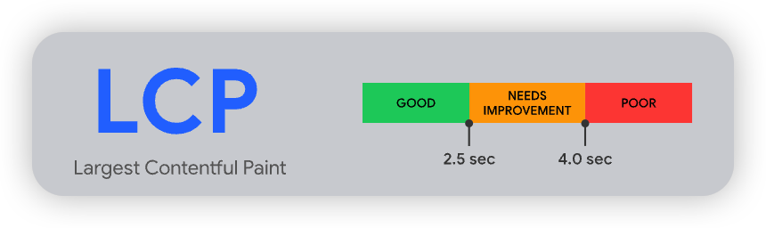

#### 哪些元素在考量范围内

根据当前[最大内容绘制 API](https://wicg.github.io/largest-contentful-paint/)中的规定，最大内容绘制考量的元素类型为：

- ``元素
- 内嵌在`<svg>`元素内的`<image>`元素
- `<video>`元素（使用封面图像）
- 通过[`url()`](https://developer.mozilla.org/docs/Web/CSS/url())函数（而非使用[CSS 渐变](https://developer.mozilla.org/docs/Web/CSS/CSS_Images/Using_CSS_gradients)）加载的带有背景图像的元素
- 包含文本节点或其他行内级文本元素子元素的[块级元素](https://developer.mozilla.org/docs/Web/HTML/Block-level_elements)。

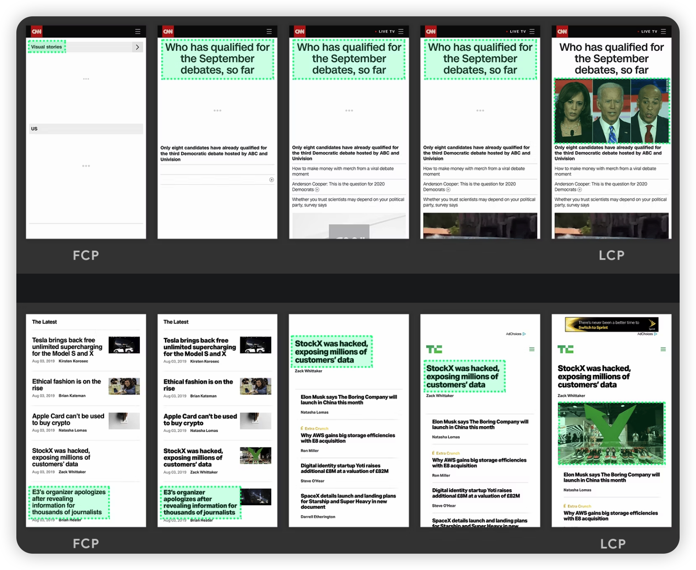

在上方的两个时间轴中，最大元素随内容加载而变化。在第一个示例中，新内容被添加进 DOM，并因此使最大元素发生了改变。在第二个示例中，由于布局的改变，先前的最大内容从可视区域中被移除。

虽然延迟加载的内容通常比页面上已有的内容更大，但实际情况并非一定如此。接下来的两个示例显示了在页面完全加载之前出现的最大内容绘制。

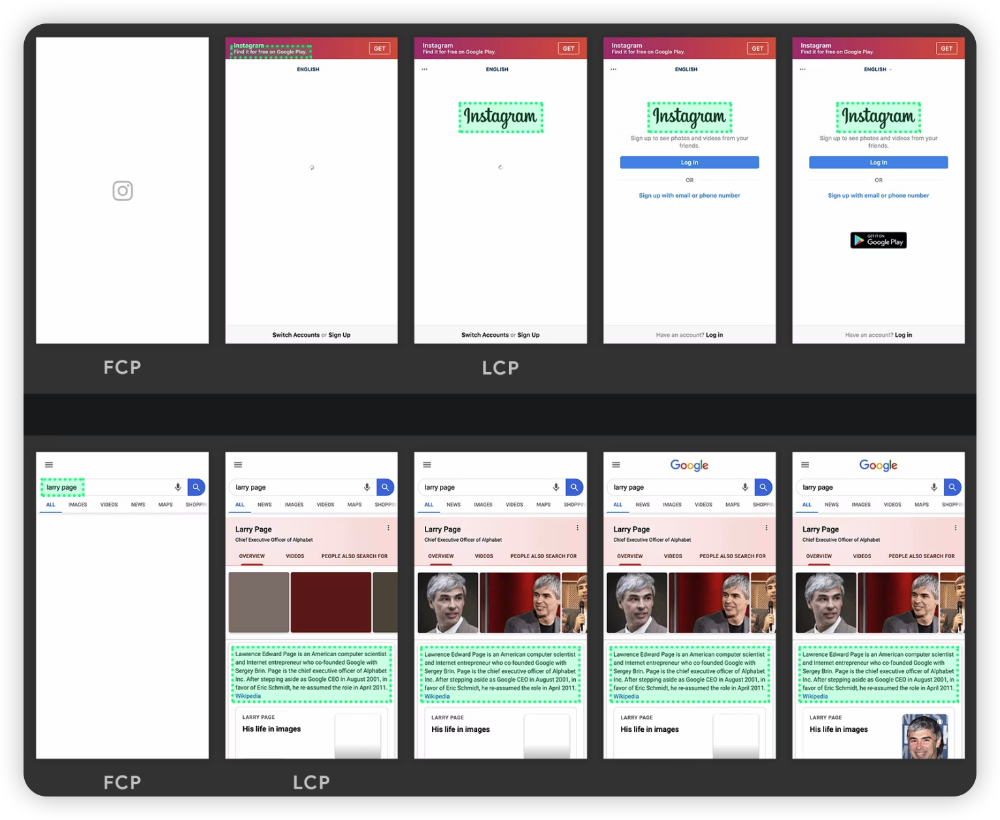

在第一个示例中，Instagram 标志加载得相对较早，即使其他内容随后陆续显示，但标志始终是最大元素。在 Google 搜索结果页面示例中，最大元素是一段文本，这段文本在所有图像或标志完成加载之前就显示了出来。由于所有单个图像都小于这段文字，因此这段文字在整个加载过程中始终是最大元素。

### [什么是 CLS?](https://web.dev/cls/)

CLS 测量整个页面生命周期内发生的所有[意外](https://web.dev/cls/#expected-vs-unexpected-layout-shifts)布局偏移中最大一连串的*布局偏移分数*。

您是否曾经历过在网上阅读一篇文章，结果页面上的某些内容突然发生改变？文本在毫无预警的情况下移位，导致您找不到先前阅读的位置。或者更糟糕的情况：您正要点击一个链接或一个按钮，但在您手指落下的瞬间，诶？链接移位了，结果您点到了别的东西！

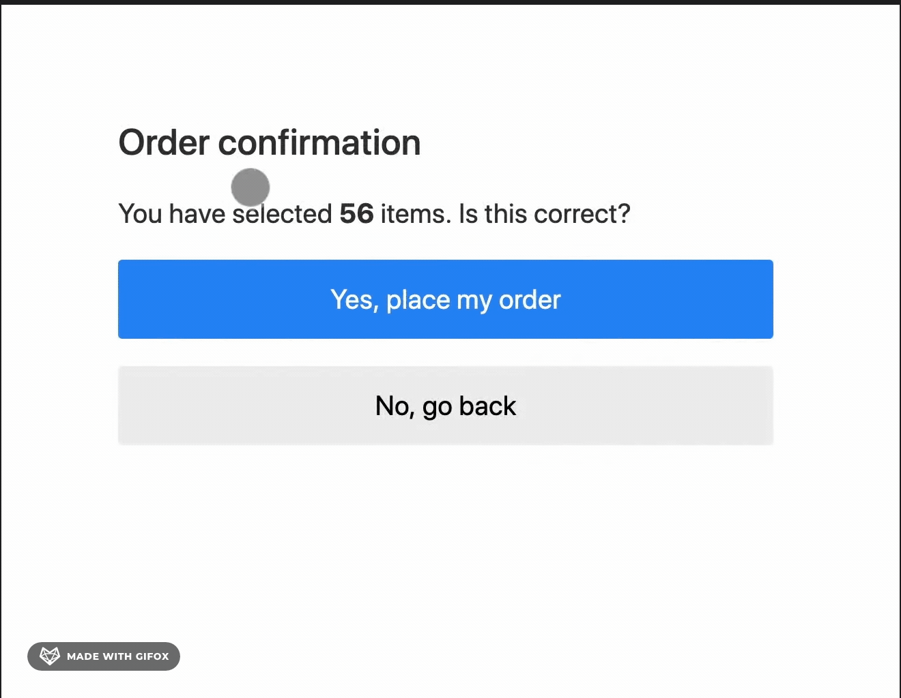

#### 怎样算是良好的 CLS 分数？

为了提供良好的用户体验，网站应该努力将 CLS 分数控制在**0.1** 或以下。为了确保您能够在大部分用户的访问期间达成建议目标值，一个良好的测量阈值为页面加载的**第 75 个百分位数**，且该阈值同时适用于移动和桌面设备。

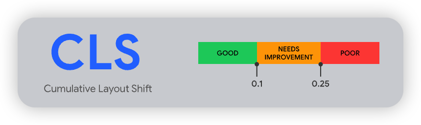

#### 影响分数

[影响分数](https://github.com/WICG/layout-instability#Impact-Fraction)测量*不稳定元素*对两帧之间的可视区域产生的影响。

前一帧*和*当前帧的所有*不稳定元素*的可见区域集合（占总可视区域的部分）就是当前帧的*影响分数*。

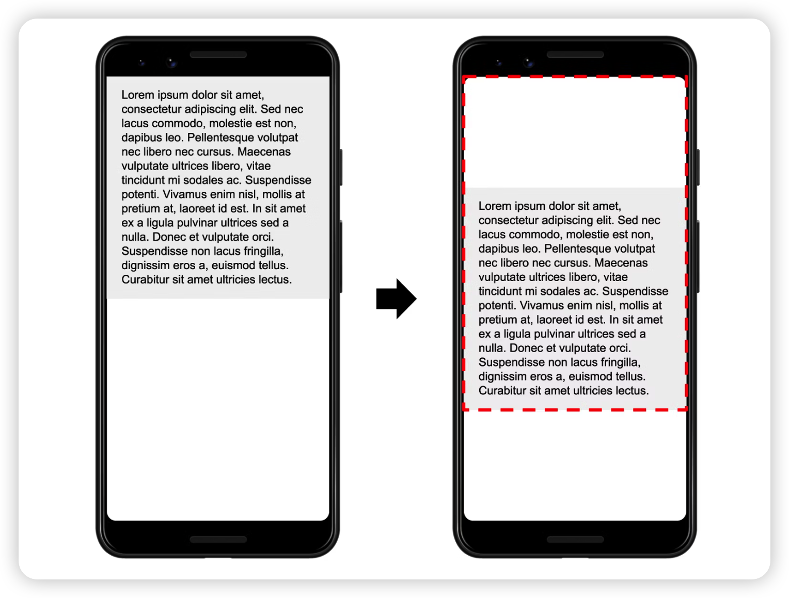

在上图中，有一个元素在一帧中占据了一半的可视区域。接着，在下一帧中，元素下移了可视区域高度的 25%。红色虚线矩形框表示两帧中元素的可见区域集合，在本示例中，该集合占总可视区域的 75%，因此其*影响分数*为`0.75` 。

### [什么是 FID？](https://web.dev/fid/)

FID 测量从用户第一次与页面交互（例如当他们单击链接、点按按钮或使用由 JavaScript 驱动的自定义控件）直到浏览器对交互作出响应，并实际能够开始处理事件处理程序所经过的时间。

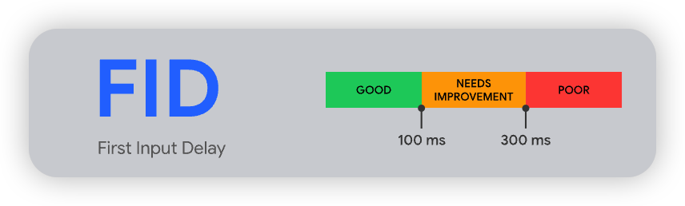

#### 如果交互没有事件侦听器怎么办？ 

FID 测量接收到输入事件的时间点与主线程下一次空闲的时间点之间的差值。这就意味着**即使在尚未注册事件侦听器的情况下，**FID 也会得到测量。这是因为许多用户交互的执行并不需要事件侦听器，但*一定*需要主线程处于空闲期。

例如，在对用户交互进行响应前，以下所有 HTML 元素都需要等待主线程上正在进行的任务完成运行：

- 文本字段、复选框和单选按钮 (`<input>` 、 `<textarea>`)
- 下拉选择列表（`<select>`）
- 链接 (`<a>`)

#### 为什么只考虑首次输入？

虽然任何输入延迟都可能导致糟糕的用户体验，但我们主要建议您测量首次输入延迟，原因如下：

- 首次输入延迟将会是用户对您网站响应度的第一印象，而第一印象对于塑造我们对网站质量和可靠性的整体印象至关重要。
- 我们现如今在网络上看到的最大的交互性问题发生在页面加载期间。因此，我们认为首先侧重于改善网站的首次用户交互将对改善网络的整体交互性产生最大的影响。
- 我们推荐网站针对较高的首次输入延迟采取的解决方案（代码拆分、减少 JavaScript 的预先加载量等）不一定与针对页面加载后输入延迟缓慢的解决方案相同。通过分离这些指标，我们将能够为网页开发者提供更确切的性能指南。

## 以技术为中心的性能指标


什么叫以技术为中心的性能指标呢？

我们再来看上面这张之前放过的图，这是 `W3C Performance Timeline Level 2` 的模型图，图中很多的时间点、时间段，对于用户来说或许并不需要知道，但是 `对于技术人员来说` ，**采集其中有意义的时间段，做成瀑图，可以让我们`从精确数据的角度`对网站的性能有一个定义，有一个优化的方向；**

### 关键时间点

| 字段      | 描述                                    | 计算公式                            | 备注                                                         |
| --------- | --------------------------------------- | ----------------------------------- | ------------------------------------------------------------ |
| FP        | 白屏时间                                | responseEnd - fetchStart            | 从请求开始到浏览器开始解析第一批HTML文档字节的时间。         |
| TTI       | 首次可交互时间                          | domInteractive - fetchStart         | 浏览器完成所有HTML解析并且完成DOM构建，此时浏览器开始加载资源。 |
| DomReady  | HTML加载完成时间也就是 DOM Ready 时间。 | domContentLoadEventEnd - fetchStart | 单页面客户端渲染下，为生成模板dom树所花费时间；非单页面或单页面服务端渲染下，为生成实际dom树所花费时间' |
| Load      | 页面完全加载时间                        | loadEventStart - fetchStart         | Load=首次渲染时间+DOM解析耗时+同步JS执行+资源加载耗时。      |
| FirstByte | 首包时间                                | responseStart - domainLookupStart   | 从DNS解析到响应返回给浏览器第一个字节的时间                  |

### 关键时间段

| 字段  | 描述            | 计算公式                                  | 备注                                                         |
| ----- | --------------- | ----------------------------------------- | ------------------------------------------------------------ |
| DNS   | DNS查询耗时     | domainLookupEnd - domainLookupStart       | 如果使用长连接或本地缓存，则数值为0                          |
| TCP   | TCP连接耗时     | connectEnd - connectStart                 | 如果使用长连接或本地缓存，则数值为0                          |
| SSL   | SSL安全连接耗时 | connectEnd - secureConnectionStart        | 只在HTTPS下有效，判断secureConnectionStart的值是否大于0,如果为0，转为减connectEnd |
| TTFB  | 请求响应耗时    | responseStart - requestStart              | TTFB有多种计算方式，相减的参数可以是 requestStart 或者 startTime |
| Trans | 内容传输耗时    | responseEnd - responseStart               | 无                                                           |
| DOM   | DOM解析耗时     | domInteractive - responseEnd              | 无                                                           |
| Res   | 资源加载耗时    | loadEventStart - domContentLoadedEventEnd | 表示页面中的同步加载资源。                                   |

# 用户行为监控

## 前端埋点

所谓**埋点**是数据采集领域（尤其是用户行为数据采集领域）的术语，其实严格来说，我们之前对错误数据的采集，对性能数据的采集，都算是一种埋点。

**埋点方案：**

- 代码埋点：用户触发某个动作后手动上报数据，优点时准确性高，能满足自定义的场景，缺点有侵入性，和目标系统耦合大，不利于维护与复用。
- ~~可视化埋点：由可视化工具进行配置采集指定元素——查找 dom 并绑定事件，优点是简单，缺点是准确性较低，针对性和自定义埋点能力较弱。~~
- 全埋点（无埋点）：由前端自动采集全部事件并上报，前端也就没有埋点成本，由数据分析平台或后端过滤有用数据，优点是数据全面，缺点是数据量大，噪声数据多。

**用户关键行为相关的埋点类型**：

- 页面埋点：统计用户进入或离开页面的各种维度信息，如页面浏览次数（PV）、页面停留时间、路由切换等。
- 点击埋点：统计用户在应用内的每一次点击事件，如新闻的浏览次数、文件下载的次数、推荐商品的命中次数等
- 曝光埋点：统计具体区域是否被用户浏览到，如活动的引流入口的显示、投放广告的显示等。

## PV、UV

PV(page view) 是页面浏览量，UV(Unique visitor)用户访问量。PV 只要访问一次页面就算一次，UV 同一天内多次访问只算一次。

对于前端来说，只要每次进入页面上报一次 PV 就行，UV 的统计可以放在服务端来做

## 页面停留时长

用户进入页面记录一个初始时间，用户离开页面时用当前时间减去初始时间，就是用户停留时长。这个计算逻辑可以放在 `beforeunload` 事件里做。

## 页面跳转

利用 `addEventListener()` 监听 `popstate`、`hashchange` 页面跳转事件。需要注意的是调用`history.pushState()`或`history.replaceState()`不会触发`popstate`事件。只有在做出浏览器动作时，才会触发该事件，如用户点击浏览器的回退按钮（或者在Javascript代码中调用`history.back()`或者`history.forward()`方法）。同理，`hashchange` 也一样。

## Vue 路由变更

Vue 可以利用 `router.beforeEach` 钩子进行路由变更的监听。