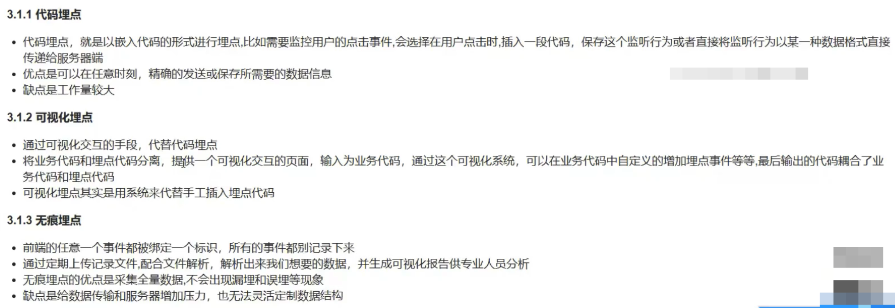
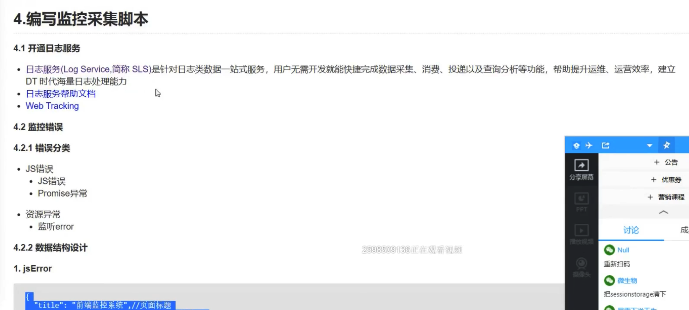
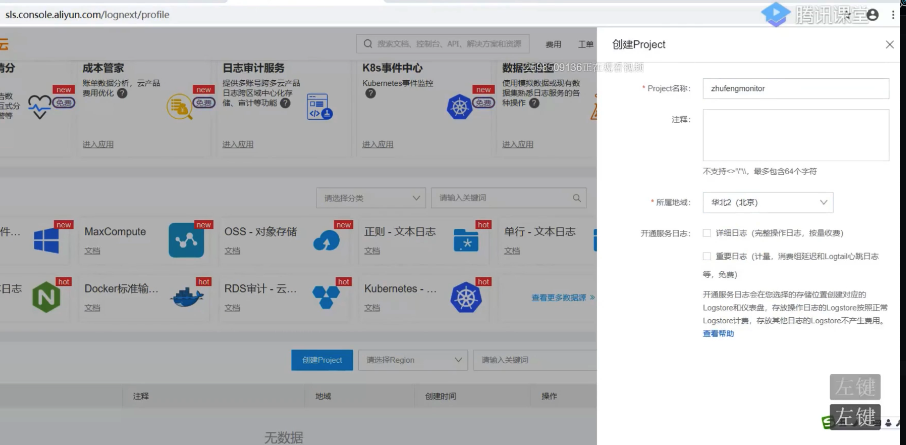
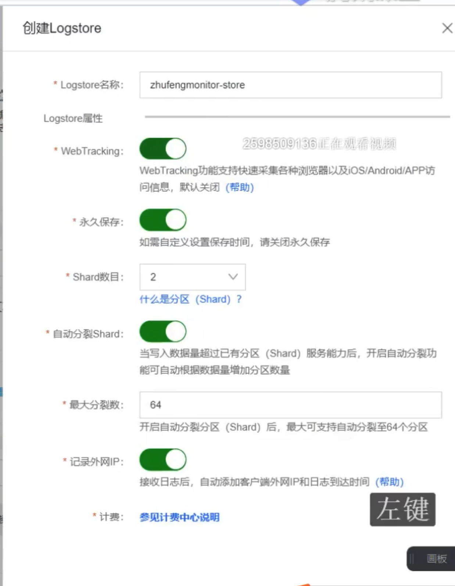
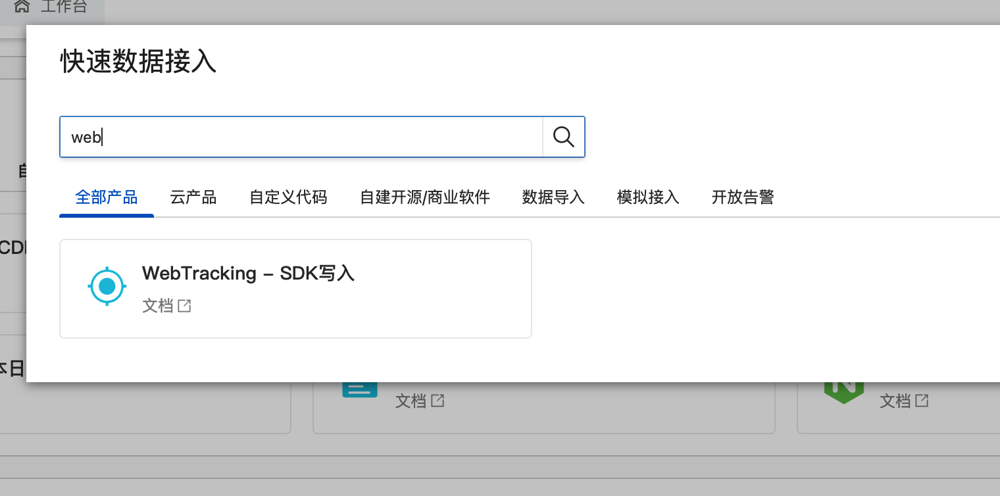
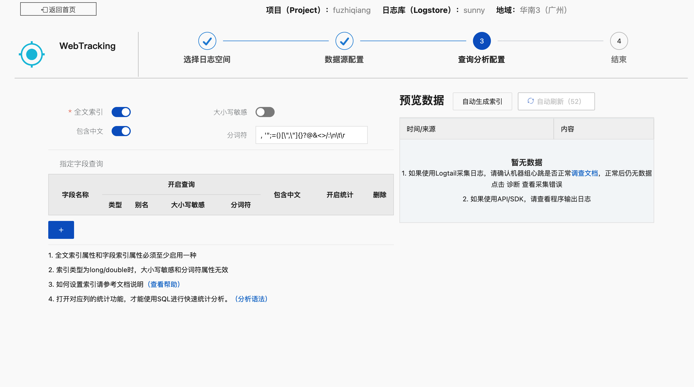
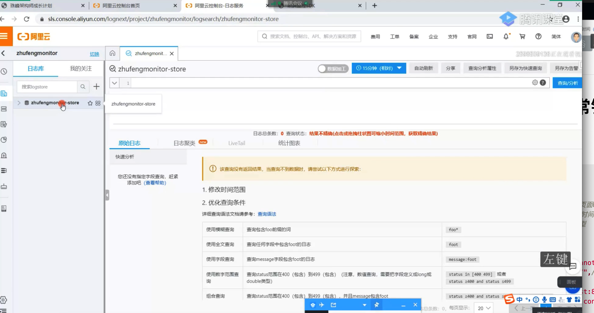
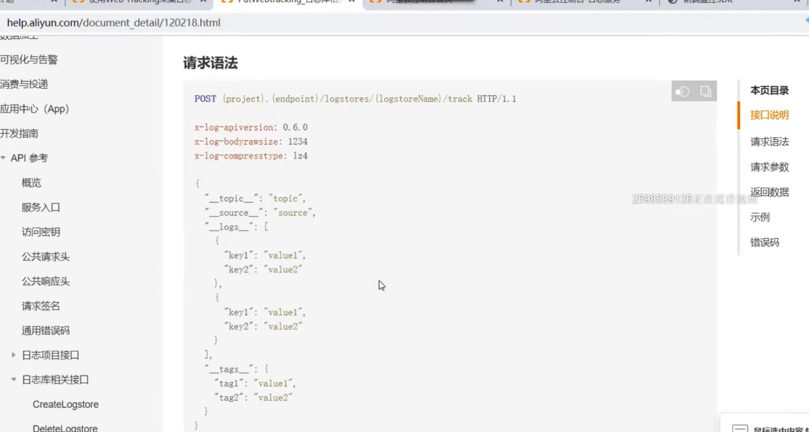
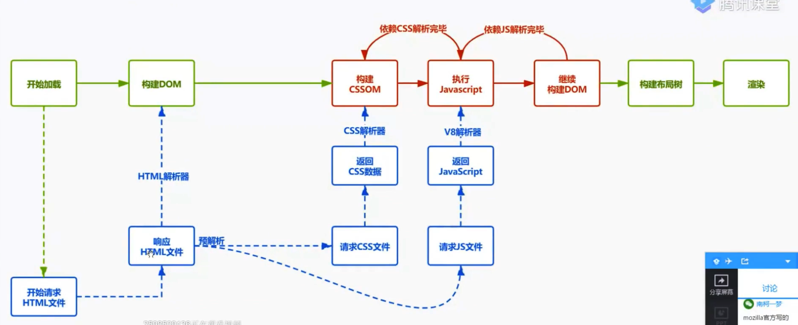
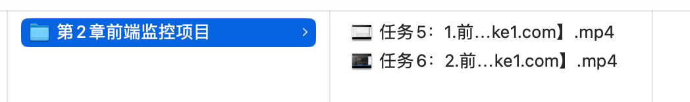

# fe-monitor

https://github.com/sl1673495/blogs/issues/92
https://github.com/xy-sea/web-see
https://gitee.com/zhang_renyang/front-monitor.git

https://github.com/clouDr-f2e/monitor

# 1.基础知识

## 1.为什么要做前端监控

- 更快发现问题和解决问题
- 做产品的决策依据 PV/UV
- 为业务扩展提供了更多可能性
- 提升前端工程师的技术深度和广度

## 2.前端监控目标

### 2.1 稳定性(stability)

| 错误名称 | 备注                         |
| :------- | :--------------------------- |
| JS 错误  | JS 执行错误或者 promise 异常 |
| 资源异常 | script、link 等资源加载异常  |
| 接口错误 | ajax 或 fetch 请求接口异常   |
| 白屏     | 页面空白                     |

### 2.2 用户体验(experience)

| 错误名称                                    | 备注                                                                                               |
| :------------------------------------------ | :------------------------------------------------------------------------------------------------- |
| 加载时间                                    | 各个阶段的加载时间                                                                                 |
| TTFB(time to first byte)(首字节时间)        | 是指浏览器发起第一个请求到数据返回第一个字节所消耗的时间，这个时间包含了网络请求时间、后端处理时间 |
| FP(First Paint)(首次绘制)                   | 首次绘制包括了任何用户自定义的背景绘制，它是将第一个像素点绘制到屏幕的时刻                         |
| FCP(First Content Paint)(首次内容绘制)      | 首次内容绘制是浏览器将第一个 DOM 渲染到屏幕的时间,可以是任何文本、图像、SVG 等的时间               |
| FMP(First Meaningful paint)(首次有意义绘制) | 首次有意义绘制是页面可用性的量度标准                                                               |
| FID(First Input Delay)(首次输入延迟)        | 用户首次和页面交互到页面响应交互的时间                                                             |
| 卡顿                                        | 超过 50ms 的长任务                                                                                 |

### 2.3 业务(business)

| 错误名称       | 备注                               |
| :------------- | :--------------------------------- |
| PV             | page view 即页面浏览量或点击量     |
| UV             | 指访问某个站点的不同 IP 地址的人数 |
| 页面的停留时间 | 用户在每一个页面的停留时间         |

## 3.前端监控流程

- 前端埋点
- 数据上报
- 分析和计算 将采集到的数据进行加工汇总
- 可视化展示 将数据按各种维度进行展示
- 监控报警 发现问题后按一定的条件触发报警


[code](https://github.com/zwhid/example/tree/master/my-monitor)

### 常见埋点方案



https://sls.console.aliyun.com/lognext/open








# 2.监控 js 和资源异常错误

## 数据结构

```js
// jsError
{
  "title": "前端监控系统",//页面标题
  "url": "http://localhost:8080/",//页面URL
  "timestamp": "1590815288710",//访问时间戳
  "userAgent": "Chrome",//用户浏览器类型
  "kind": "stability",//大类
  "type": "error",//小类
  "errorType": "jsError",//错误类型
  "message": "Uncaught TypeError: Cannot set property 'error' of undefined",//类型详情
  "filename": "http://localhost:8080/",//访问的文件名
  "position": "0:0",//行列信息
  "stack": "btnClick (http://localhost:8080/:20:39)^HTMLInputElement.onclick (http://localhost:8080/:14:72)",//堆栈信息
  "selector": "HTML BODY #container .content INPUT"//选择器
}
```

```js
// promiseError
{
  "title": "前端监控系统",//页面标题
  "url": "http://localhost:8080/",//页面URL
  "timestamp": "1590815290600",//访问时间戳
  "userAgent": "Chrome",//用户浏览器类型
  "kind": "stability",//大类
  "type": "error",//小类
  "errorType": "promiseError",//错误类型
  "message": "someVar is not defined",//类型详情
  "filename": "http://localhost:8080/",//访问的文件名
  "position": "24:29",//行列信息
  "stack": "http://localhost:8080/:24:29^new Promise (<anonymous>)^btnPromiseClick (http://localhost:8080/:23:13)^HTMLInputElement.onclick (http://localhost:8080/:15:86)",//堆栈信息
  "selector": "HTML BODY #container .content INPUT"//选择器
}
```

```js
// resourceError
{
  "title": "前端监控系统",//页面标题
  "url": "http://localhost:8080/",//页面URL
  "timestamp": "1590816168643",//访问时间戳
  "userAgent": "Chrome",//用户浏览器类型
  "kind": "stability",//大类
  "type": "error",//小类
  "errorType": "resourceError",//错误类型
  "filename": "http://localhost:8080/error.js",//访问的文件名
  "tagName": "SCRIPT",//标签名
  "timeStamp": "76",//时间
  "selector": "HTML BODY SCRIPT"//选择器
}
```

## 示例代码

```html
<!-- js错误示例，变量不存在 -->
function errorClick() { window.someVar.error = 'error' }

<!-- promise错误示例 -->
function promiseClick() { new Promise(function (resolve, reject) {
reject('出错了') }) }
```

## 代码实现

```js
import getLastEvent from '../utils/getLastEvent';
import getSelector from '../utils/getSelector';
import tracker from '../utils/tracker';
export function injectJsError() {
  //监听全局未捕获的错误
  window.addEventListener(
    'error',
    function(event) {
      //错误事件对象
      let lastEvent = getLastEvent(); //最后一个交互事件
      //这是一个资源异常错误
      if (event.target && (event.target.src || event.target.href)) {
        tracker.send({
          kind: 'stability', //监控指标的大类
          type: 'error', //小类型 这是一个错误
          errorType: 'resourceError', //js或css资源加载错误
          filename: event.target.src || event.target.href, //哪个文件报错了
          tagName: event.target.tagName, //SCRIPT
          //body div#container div.content input
          selector: getSelector(event.target), //代表最后一个操作的元素
        });
      } else {
        tracker.send({
          kind: 'stability', //监控指标的大类
          type: 'error', //小类型 这是一个错误
          errorType: 'jsError', //JS执行错误
          message: event.message, //报错信息
          filename: event.filename, //哪个文件报错了
          position: `${event.lineno}:${event.colno}`,
          stack: getLines(event.error.stack),
          //body div#container div.content input
          selector: lastEvent ? getSelector(lastEvent.path) : '', //代表最后一个操作的元素
        });
      }
    },
    true,
  );
  window.addEventListener(
    'unhandledrejection',
    event => {
      // promise错误
      console.log(event);
      let lastEvent = getLastEvent(); //最后一个交互事件
      let message;
      let filename;
      let line = 0;
      let column = 0;
      let stack = '';
      let reason = event.reason;
      if (typeof reason === 'string') {
        message = reason;
      } else if (typeof reason === 'object') {
        //说明是一个错误对象
        message = reason.message;
        //at http://localhost:8080/:23:38
        if (reason.stack) {
          let matchResult = reason.stack.match(/at\s+(.+):(\d+):(\d+)/);
          filename = matchResult[1];
          line = matchResult[2];
          column = matchResult[3];
        }

        stack = getLines(reason.stack);
      }
      tracker.send({
        kind: 'stability', //监控指标的大类
        type: 'error', //小类型 这是一个错误
        errorType: 'promiseError', //JS执行错误
        message, //报错信息
        filename, //哪个文件报错了
        position: `${line}:${column}`,
        stack,
        //body div#container div.content input
        selector: lastEvent ? getSelector(lastEvent.path) : '', //代表最后一个操作的元素
      });
    },
    true,
  );

  function getLines(stack) {
    return stack
      .split('\n')
      .slice(1)
      .map(item => item.replace(/^\s+at\s+/g, ''))
      .join('^');
  }
}
```

### utils 工具箱代码

```js
// utils/getSelector.js

function getSelectors(path) {
  return path
    .reverse()
    .filter(element => {
      return element !== document && element !== window;
    })
    .map(element => {
      let selector = '';
      if (element.id) {
        return `${element.nodeName.toLowerCase()}#${element.id}`;
      } else if (element.className && typeof element.className === 'string') {
        return `${element.nodeName.toLowerCase()}.${element.className}`;
      } else {
        selector = element.nodeName.toLowerCase();
      }
      return selector;
    })
    .join(' ');
}
export default function(pathsOrTarget) {
  if (Array.isArray(pathsOrTarget)) {
    //可能是一个数组
    return getSelectors(pathsOrTarget);
  } else {
    //也有可有是一个对象
    let path = [];
    while (pathsOrTarget) {
      path.push(pathsOrTarget);
      pathsOrTarget = pathsOrTarget.parentNode;
    }
    return getSelectors(path);
  }
}
```

```js
// utils/getLastEvent.js
let lastEvent;
['click', 'touchstart', 'mousedown', 'keydown', 'mouseover'].forEach(
  eventType => {
    document.addEventListener(
      eventType,
      event => {
        lastEvent = event;
      },
      {
        capture: true, //捕获阶段
        passive: true, //默认不阻止默认事件
      },
    );
  },
);
export default function() {
  return lastEvent;
}
```

```js
// utils/onload.js
export default function(callback) {
  if (document.readyState === 'complete') {
    callback();
  } else {
    window.addEventListener('load', callback);
  }
}
```

```js
// utils/tracker.js

let userAgent = require('user-agent');
let project = 'sms-monitor';
let host = 'cn-shenzhen.log.aliyuncs.com';
let logstoreName = 'sms-monitor-store';

function getExtraData() {
  return {
    title: document.title,
    url: location.href,
    timestamp: Date.now(),
    userAgent: userAgent.parse(navigator.userAgent).name,
    userId: '',
  };
}
class SendTracker {
  constructor() {
    this.url = `http://${project}.${host}/logstores/${logstoreName}/track`; //上报的路径
    this.xhr = new XMLHttpRequest();
  }
  send(data = {}) {
    let extraData = getExtraData();
    let log = { ...extraData, ...data };
    //对象 的值不能是数字
    for (let key in log) {
      if (typeof log[key] === 'number') {
        log[key] = `${log[key]}`;
      }
    }
    console.log('log', log);
    let body = JSON.stringify({
      __logs__: [log],
    });
    this.xhr.open('POST', this.url, true);
    this.xhr.setRequestHeader('Content-Type', 'application/json'); //请求体类型
    this.xhr.setRequestHeader('x-log-apiversion', '0.6.0'); //版本号,阿里云规定
    this.xhr.setRequestHeader('x-log-bodyrawsize', body.length); //请求体的大小
    this.xhr.onload = function() {
      // console.log(this.xhr.response);
    };
    this.xhr.onerror = function(error) {
      //console.log(error);
    };
    this.xhr.send(body);
  }
}
export default new SendTracker();
```


# 3.监控接口错误

## 数据结构

```js
{
  "title": "前端监控系统",
  "url": "http://localhost:8080/",
  "timestamp": "1590817025617",
  "userAgent": "Chrome",
  "kind": "stability",
  "type": "xhr",
  "eventType": "load",
  "pathname": "/error",
  "status": "500-Internal Server Error",
  "duration": "7",
  "response": "",
  "params": "name=zhufeng"
}
```

## 代码实现

```js
import tracker from '../utils/tracker';
export function injectXHR() {
  let XMLHttpRequest = window.XMLHttpRequest;
  let oldOpen = XMLHttpRequest.prototype.open;
  XMLHttpRequest.prototype.open = function(method, url, async) {
    if (!url.match(/logstores/) && !url.match(/sockjs/)) { 
      // 防止死循环，上报请求就不要拦截了
      this.logData = { method, url, async };
    }
    return oldOpen.apply(this, arguments);
  };
  //axios 背后有两种 如果 browser XMLHttpRequest  node http
  let oldSend = XMLHttpRequest.prototype.send;
  //fetch怎么监听
  XMLHttpRequest.prototype.send = function(body) {
    if (this.logData) {
      let startTime = Date.now(); //在发送之前记录一下开始的时间
      //XMLHttpRequest  readyState 0 1 2 3 4
      //status 2xx 304 成功 其它 就是失败
      let handler = type => event => {
        let duration = Date.now() - startTime;
        let status = this.status; //200 500
        let statusText = this.statusText; // OK Server Error
        tracker.send({
          kind: 'stability',
          type: 'xhr',
          eventType: type, //load error abort
          pathname: this.logData.url, //请求路径
          status: status + '-' + statusText, //状态码
          duration, //持续时间
          response: this.response ? JSON.stringify(this.response) : '', //响应体
          params: body || '',
        });
      };
      this.addEventListener('load', handler('load'), false);
      this.addEventListener('error', handler('error'), false);
      this.addEventListener('abort', handler('abort'), false);
    }
    return oldSend.apply(this, arguments);
  };
}
```


# 4.白屏

## 数据结构

```js
{
  "title": "前端监控系统",
  "url": "http://localhost:8080/",
  "timestamp": "1590822618759",
  "userAgent": "chrome",
  "kind": "stability",      //大类
  "type": "blank",          //小类
  "emptyPoints": "0",       //空白点
  "screen": "2049x1152",    //分辨率
  "viewPoint": "2048x994",  //视口
  "selector": "HTML BODY #container" //选择器
}
```

## 代码实现

```js
import tracker from '../utils/tracker';
import onload from '../utils/onload';
export function blankScreen() {
  let wrapperElements = ['html', 'body', '#container', '.content'];
  let emptyPoints = 0;
  function getSelector(element) {
    if (element.id) {
      return '#' + element.id;
    } else if (element.className) {
      // a b c => .a.b.c
      return (
        '.' +
        element.className
          .split(' ')
          .filter(item => !!item)
          .join('.')
      );
    } else {
      return element.nodeName.toLowerCase();
    }
  }
  function isWrapper(element) {
    let selector = getSelector(element);
    if (wrapperElements.indexOf(selector) != -1) {
      emptyPoints++;
    }
  }
  onload(function() {
    for (let i = 1; i <= 9; i++) {
      let xElements = document.elementsFromPoint(
        (window.innerWidth * i) / 10,
        window.innerHeight / 2,
      );
      let yElements = document.elementsFromPoint(
        window.innerWidth / 2,
        (window.innerHeight * i) / 10,
      );
      isWrapper(xElements[0]);
      isWrapper(yElements[0]);
    }

    if (emptyPoints >= 18) {
      let centerElements = document.elementsFromPoint(
        window.innerWidth / 2,
        window.innerHeight / 2,
      );
      tracker.send({
        kind: 'stability',
        type: 'blank',
        emptyPoints,
        screen: window.screen.width + 'X' + window.screen.height,
        viewPoint: window.innerWidth + 'X' + window.innerHeight,
        selector: getSelector(centerElements[0]),
      });
    }
  });
}
```


# 5.性能和体验指标

```js
{
  "title": "前端监控系统",
  "url": "http://localhost:8080/",
  "timestamp": "1590828364183",
  "userAgent": "chrome",
  "kind": "experience",
  "type": "timing",
  "connectTime": "0",
  "ttfbTime": "1",
  "responseTime": "1",
  "parseDOMTime": "80",
  "domContentLoadedTime": "0",
  "timeToInteractive": "88",
  "loadTime": "89"
}
```

```js
{
  "title": "前端监控系统",
  "url": "http://localhost:8080/",
  "timestamp": "1590828364186",
  "userAgent": "chrome",
  "kind": "experience",
  "type": "paint",
  "firstPaint": "102",
  "firstContentPaint": "2130",
  "firstMeaningfulPaint": "2130",
  "largestContentfulPaint": "2130"
}
```

```js
{
  "title": "前端监控系统",
  "url": "http://localhost:8080/",
  "timestamp": "1590828477284",
  "userAgent": "chrome",
  "kind": "experience",
  "type": "firstInputDelay",
  "inputDelay": "3",
  "duration": "8",
  "startTime": "4812.344999983907",
  "selector": "HTML BODY #container .content H1"
}
```

## 代码实现

```js
import tracker from '../utils/tracker';
import onload from '../utils/onload';
import getLastEvent from '../utils/getLastEvent';
import getSelector from '../utils/getSelector';
export function timing() {
  let FMP, LCP;
  // 增加一个性能条目的观察者
  if (PerformanceObserver) {
    new PerformanceObserver((entryList, observer) => {
      let perfEntries = entryList.getEntries();
      FMP = perfEntries[0]; //startTime 2000以后
      observer.disconnect(); //不再观察了
    }).observe({ entryTypes: ['element'] }); //观察页面中的意义的元素

    new PerformanceObserver((entryList, observer) => {
      let perfEntries = entryList.getEntries();
      LCP = perfEntries[0];
      observer.disconnect(); //不再观察了
    }).observe({ entryTypes: ['largest-contentful-paint'] }); //观察页面中的意义的元素

    new PerformanceObserver((entryList, observer) => {
      let lastEvent = getLastEvent();
      let firstInput = entryList.getEntries()[0];
      console.log('FID', firstInput);
      if (firstInput) {
        //processingStart开始处理的时间 startTime开点击的时间 差值就是处理的延迟
        let inputDelay = firstInput.processingStart - firstInput.startTime;
        let duration = firstInput.duration; //处理的耗时
        if (inputDelay > 0 || duration > 0) {
          tracker.send({
            kind: 'experience', //用户体验指标
            type: 'firstInputDelay', //首次输入延迟
            inputDelay, //延时的时间
            duration, //处理的时间
            startTime: firstInput.startTime,
            selector: lastEvent
              ? getSelector(lastEvent.path || lastEvent.target)
              : '',
          });
        }
      }
      observer.disconnect(); //不再观察了
    }).observe({ type: 'first-input', buffered: true }); //观察页面中的意义的元素
  }

  //用户的第一次交互 点击页面
  onload(function() {
    setTimeout(() => {
      const {
        fetchStart,
        connectStart,
        connectEnd,
        requestStart,
        responseStart,
        responseEnd,
        domLoading,
        domInteractive,
        domContentLoadedEventStart,
        domContentLoadedEventEnd,
        loadEventStart,
      } = performance.timing;
      tracker.send({
        kind: 'experience', //用户体验指标
        type: 'timing', //统计每个阶段的时间
        connectTime: connectEnd - connectStart, //连接时间
        ttfbTime: responseStart - requestStart, //首字节到达时间
        responseTime: responseEnd - responseStart, //响应的读取时间
        parseDOMTime: loadEventStart - domLoading, //DOM解析的时间
        domContentLoadedTime:
          domContentLoadedEventEnd - domContentLoadedEventStart,
        timeToInteractive: domInteractive - fetchStart, //首次可交互时间
        loadTIme: loadEventStart - fetchStart, //完整的加载时间
      });

      let FP = performance.getEntriesByName('first-paint')[0];
      let FCP = performance.getEntriesByName('first-contentful-paint')[0];
      //开始发送性能指标
      console.log('FP', FP);
      console.log('FCP', FCP);
      console.log('FMP', FMP);
      console.log('LCP', LCP);
      tracker.send({
        kind: 'experience', //用户体验指标
        type: 'paint', //统计每个阶段的时间
        firstPaint: FP.startTime,
        firstContentfulPaint: FCP.startTime,
        firstMeaningfulPaint: FMP.startTime,
        largestContentfulPaint: LCP.startTime,
      });
    }, 3000);
  });
}
```

---




| 字段                       | 含义                                                                                                                                                                                      |
| :------------------------- | :---------------------------------------------------------------------------------------------------------------------------------------------------------------------------------------- |
| navigationStart            | 初始化页面，在同一个浏览器上下文中前一个页面 unload 的时间戳，如果没有前一个页面的 unload,则与 fetchStart 值相等                                                                          |
| redirectStart              | 第一个 HTTP 重定向发生的时间,有跳转且是同域的重定向,否则为 0                                                                                                                              |
| redirectEnd                | 最后一个重定向完成时的时间,否则为 0                                                                                                                                                       |
| fetchStart                 | 浏览器准备好使用 http 请求获取文档的时间,这发生在检查缓存之前                                                                                                                             |
| domainLookupStart          | DNS 域名开始查询的时间,如果有本地的缓存或 keep-alive 则时间为 0                                                                                                                           |
| domainLookupEnd            | DNS 域名结束查询的时间                                                                                                                                                                    |
| connectStart               | TCP 开始建立连接的时间,如果是持久连接,则与`fetchStart`值相等                                                                                                                              |
| secureConnectionStart      | https 连接开始的时间,如果不是安全连接则为 0                                                                                                                                               |
| connectEnd                 | TCP 完成握手的时间，如果是持久连接则与`fetchStart`值相等                                                                                                                                  |
| requestStart               | HTTP 请求读取真实文档开始的时间,包括从本地缓存读取                                                                                                                                        |
| requestEnd                 | HTTP 请求读取真实文档结束的时间,包括从本地缓存读取                                                                                                                                        |
| responseStart              | 返回浏览器从服务器收到（或从本地缓存读取）第一个字节时的 Unix 毫秒时间戳                                                                                                                  |
| responseEnd                | 返回浏览器从服务器收到（或从本地缓存读取，或从本地资源读取）最后一个字节时的 Unix 毫秒时间戳                                                                                              |
| unloadEventStart           | 前一个页面的 unload 的时间戳 如果没有则为 0                                                                                                                                               |
| unloadEventEnd             | 与`unloadEventStart`相对应，返回的是`unload`函数执行完成的时间戳                                                                                                                          |
| domLoading                 | 返回当前网页 DOM 结构开始解析时的时间戳,此时`document.readyState`变成 loading,并将抛出`readyStateChange`事件                                                                              |
| domInteractive             | 返回当前网页 DOM 结构结束解析、开始加载内嵌资源时时间戳,`document.readyState` 变成`interactive`，并将抛出`readyStateChange`事件(注意只是 DOM 树解析完成,这时候并没有开始加载网页内的资源) |
| domContentLoadedEventStart | 网页 domContentLoaded 事件发生的时间                                                                                                                                                      |
| domContentLoadedEventEnd   | 网页 domContentLoaded 事件脚本执行完毕的时间,domReady 的时间                                                                                                                              |
| domComplete                | DOM 树解析完成,且资源也准备就绪的时间,`document.readyState`变成`complete`.并将抛出`readystatechange`事件                                                                                  |
| loadEventStart             | load 事件发送给文档，也即 load 回调函数开始执行的时间                                                                                                                                     |
| loadEventEnd               | load 回调函数执行完成的时间                                                                                                                                                               |


# 6.pv

## 数据结构

```js
{
  "title": "前端监控系统",
  "url": "http://localhost:8080/",
  "timestamp": "1590829304423",
  "userAgent": "chrome",
  "kind": "business",
  "type": "pv",
  "effectiveType": "4g",
  "rtt": "50",
  "screen": "2049x1152"
}
```

## 代码实现

```js
import tracker from '../util/tracker';
export function pv() {
  var connection = navigator.connection;
  tracker.send({
    kind: 'business',
    type: 'pv',
    effectiveType: connection.effectiveType, //网络环境
    rtt: connection.rtt, //往返时间
    screen: `${window.screen.width}x${window.screen.height}`, //设备分辨率
  });
  let startTime = Date.now();
  window.addEventListener(
    'unload',
    () => {
      let stayTime = Date.now() - startTime;
      tracker.send({
        kind: 'business',
        type: 'stayTime',
        stayTime,
      });
    },
    false,
  );

  /*
  	// navigator.sendBeacon() 可用于通过HTTP将少量数据异步传输到Web服务器
    window.addEventListener('unload', logData, false);
    function logData() {
        navigator.sendBeacon("/log", {
            kind: 'business',
            type: 'stayTime',
            stayTime
        });
    }
    */
}
```

使用 **`sendBeacon()`**方法会使用户代理在有机会时异步地向服务器发送数据，同时不会延迟页面的卸载或影响下一导航的载入性能。这就解决了提交分析数据时的所有的问题：数据可靠，传输异步并且不会影响下一页面的加载。


# 一、代码执行的错误捕获
1. try...catch  
   + 使用try...catch包裹，影响代码可读性。无法处理异步中的错误无法处理语法错误。
2. window.onerror  
   + 要比try...catch强一些，无论是异步还是非异步错误，window.onerror都能捕获到运行时错误。
   + 缺点：监听不到资源加载的报错onerror，事件处理只能声明一次，不会重复执行多个回调。 
3. window.addEventListener('error', fn, true)，可以监听到资源加载报错，也可以注册多个事件处理函数。  
4. window.addEventListener('unhandlerejection')，捕获Promise错误。

# 二、资源加载的错误捕获
1. imgObj.onerror()
2. performance.getEntries()，获取到成功加载的资源，对比可以简介的捕获错误。  
3. window.addEventListener('error', fn, true)，会捕获但是不冒泡，所以window.onerror不会触发。

# 三、错误上报
一般使用image来上报（这是大厂方式！）。  
使用图片发送get请求，上报信息，由于浏览器对图片又缓存，同样的请求图片只会发送一次，避免重复上报。

# 四、借助第三方库
sentry-javascript


# 第2章前端监控项目

去百度网盘看完剩余课程


