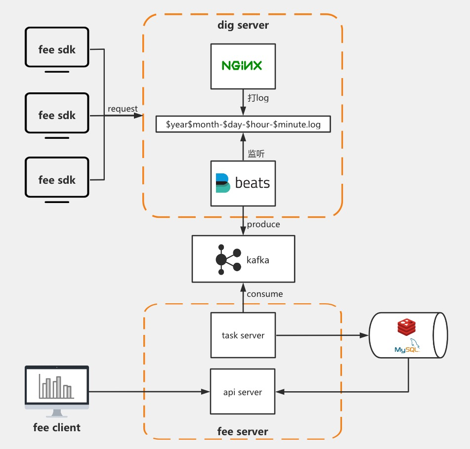

# 前端监控概述

## 本次训练营规划

0. 准备：安装虚拟机3台；Mac/Windows本机安装docker
1. 前端监控概述、sentry、前端监控系统架构、fee仓库
2. 配置打点服务
3. SDK的使用
4. 配置kafka和filebeat
5. 部署mysql和redis，修改fee，并部署server部分
6. 部署client部分，串起整体流程

## 预先环境准备

1. 物理本机Mac/Windows：安装`Docker Desktop`
2. 虚拟机centos7一台A：运行打点服务和可视化展示的前端服务，以及filebeat
3. 虚拟机centos7一台B：运行kafka服务
4. 虚拟机centos7一台C：运行`task server`、`api server`和`mysql`、`redis`

如果不方便建多个虚拟机系统，也可以把这些服务都运行在mac本机或者一个虚拟机系统上

参考链接:

- [虚拟机VMware安装Centos7参考链接](https://blog.csdn.net/babyxue/article/details/80970526)

## 1. 为什么需要做前端监控

如果没有前端监控，我们的前端项目在线上“裸奔”：
    - 那么我们不会知道我们写的代码，在不同系统、不同浏览器、不同网络环境条件下，有没有缺陷？页面访问的速度快还是慢？只能等待用户反馈，可能用户反馈过来的时候，已经在抱怨了。即使反馈，用户还不一定能全面保留案发现场的信息，我们可能很难复现问题。
    - 我们不知道我们的用户访问量、菜单点击量、用户停留时长等信息，我们好不容易开发出来的产品，可能根本没有人使用而我们自己不知道。
    - 我们缺乏浏览器型号、版本和操作系统等对处理前端兼容性至关重要的信息。

## 2. 前端监控目标

### 2.1 稳定性（stability）

| 错误类型 | 备注 |
| -------- | ---- |
| JS错误 | JS运行时错误、未捕获的promise异常 |
| 资源加载错误 | script、style、image、audio、video等资源加载错误 |
| 控制台抛出错误 | 控制台Vue、React等抛错 |
| try...catch错误 | try...catch... |
| 接口错误 | ajax、fetch请求异常 |
| 白屏 | 页面空白 |

### 2.2 用户体验（experience）

| 错误名称 | 备注 |
| -------- | ---- |
| 加载时间 | 各个阶段的加载时间 |
| TTFB(time to first byte)(首字节时间) | 是指浏览器发起第一个请求到数据返回第一个字节所消耗的时间，这个时间包含了网络请求时间、后端处理时间 |
| FP(First Paint)(首次绘制) | 首次绘制包括了任何用户自定义的背景绘制，它是将第一个像素点绘制到屏幕的时刻 |
| FCP(First Content Paint)(首次内容绘制) | 首次内容绘制是浏览器将第一个DOM渲染到屏幕的时间，可以是任何文本、图像、SVG等的时间 |
| FMP(First Meaningful paint)(首次有意义绘制) | 首次有意义绘制是页面可用性的量度标准 |
| FID(First Input Delay)(首次输入延迟) | 用户首次和页面交互到页面响应交互的时间 |
| 卡顿 | 超过50ms的长任务 |

参考链接:

[页面各阶段加载时间PerformanceTiming定义参见MDN](https://developer.mozilla.org/zh-CN/docs/Web/API/PerformanceTiming)

### 2.3 业务（business）

| 类型 | 备注 |
| -------- | ---- |
| PV | page view 即页面浏览量或点击量 |
| UV | 指访问某个站点的不同IP地址的人数 |
| 页面的停留时间 | 用户在每一个页面的停留时间 |
| 菜单点击量 | 用户在每个菜单点击的次数 |
| 用户停留时长 | 用户访问一次站点停留的时间 |
| 新增用户数据 | 新增用户数据 |

## 3. `Vue + Docker + Sentry`搭建前端监控系统

我们先通过搭建Sentry平台，了解前端监控流程

### 3.1 sentry介绍

> Sentry应用监控平台可以帮助每个开发者诊断，修复和优化其代码的性能。超过6万个组织的100万开发人员已经通过Sentry更快地交付了更好的软件。

参考链接:

- [Sentry官网](https://sentry.io/welcome/)

### 3.2 下载sentry仓库

- 下载、安装并运行docker

    - Docker是一个开放源代码软件，是一个开放平台，用于开发应用、交付（shipping）应用、运行应用。 Docker允许用户将基础设施（Infrastructure）中的应用单独分割出来，形成更小的颗粒（容器），从而提高交付软件的速度
    - Docker通过镜像启动一个容器，一个镜像是一个可执行的包，其中包括运行应用程序所需要的所有内容包含代码，运行时间，库、环境变量、和配置文件。容器是镜像的运行实例，当被运行时有镜像状态和用户进程，可以使用`docker ps`查看
    - Docker的优势在于 快速，轻量，灵活。开发者可以快速制作一个自己自定义的镜像，也可以使用官方现有的镜像来启动一个服务。且容器之间相互隔离不冲突，但硬件资源又是共享的
    - 镜像也可以快速分享，你可以将镜像保存为文件进行分享传输，也可以上传到镜像库进行存取和管理
    - Docker在sentry中的作用，通过`docker-compose`把sentry各服务组合，可以一键部署sentry服务
    - 通过`docker-compose`用户可以很容易地用一个配置文件定义一个多容器的应用，然后使用一条指令安装这个应用的所有依赖，完成构建。`docker-compose`解决了容器与容器之间如何管理编排的问

    参考链接:

    - [docker官网](https://www.docker.com/)
    - [Docker Desktop for Mac官方下载地址](https://hub.docker.com/editions/community/docker-ce-desktop-mac/)
    - [Docker Desktop for Windows官方下载地址](https://hub.docker.com/editions/community/docker-ce-desktop-windows/)
    - [Docker 入门教程](http://www.ruanyifeng.com/blog/2018/02/docker-tutorial.html)

- 增加docker内存分配：`Docker` -> `Preferences` -> `Resources` -> `Memory`分配3G

- 下载并进入sentry仓库

    ```bash
    git clone https://github.com/getsentry/onpremise.git
    cd onpremise
    ```

- 拉取sentry的docker镜像

    ```bash
    ./install.sh
    ```

- 拉取过程中会提示

    - Would you like to create a user account now? 输入y
    - Email: 输入email地址
    - Password: 输入密码
    - Repeat for confirmation: 确认密码

- 启动容器

    ```bash
    docker-compose up -d
    ```

### 3.3 访问sentry服务

- 浏览器访问`localhost:9000`
- 输入账号密码，进入sentry控制台
- 点击账号名称，选择`Organization settings` -> `General Settings`，修改组织名称`Name`，例如`test-organization`
- 创建一个监控项目，菜单选择`Projects` -> `Create Project`
- 在创建界面，选择`Browser` -> `Vue`，`Give your project a name`填写`hello-world`，点击`Create Project`
- 创建成功后，会跳到一个`getting-started`页

### 3.4 创建vue项目

- 创建`hello-world`项目

    ```bash
    npm i --registry=https://registry.npm.taobao.org -g @vue/cli
    vue create hello-world
    ```

- 安装sentry浏览器sdk`@sentry/browser`、sentry集成vue包`@sentry/integrations`和`@sentry/tracing`

    ```bash
    npm i --registry=https://registry.npm.taobao.org -S @sentry/browser @sentry/integrations @sentry/tracing
    ```

- 我们到创建项目后跳到的`getting-started`页，复制以下信息，粘贴到`app.js`：引入初始化`sentry sdk`，并初始化sentry。

    ```js
    // app.js
    import * as Sentry from "@sentry/browser";
    import { Vue as VueIntegration } from "@sentry/integrations";
    import { Integrations } from '@sentry/tracing';

    Sentry.init({
        dsn: "http://f41675a189f544fda802a8b3f62dca31@localhost:9000/2",
        integrations: [
            new VueIntegration({ Vue, tracing: true }),
            new Integrations.BrowserTracing()
        ],
        tracesSampleRate: 1
    });
    ```

- sentry初始化中配置logErrors和release

    ```js
    // app.js
    Sentry.init({
        dsn: 'http://2321dcsj1ej21ji12@localhost:9000/2',
        integrations: [new VueIntegration({Vue, attachProps: true, logErrors: true})],
        release: 'pro@1.0.0'
    });
    ```

- 在`src/components/HelloWorld.vue`中模拟一个vue错误，打印一个不存在变量a的属性b

    ```html
    <template>
        <div class="hello">
            <h1 @click="handleClick">{{ msg }}</h1>
        </div>
    </template>
    <script>
    export default {
        name: 'HelloWorld',
        props: {
            msg: String
        },
        methods: {
            handleClick() {
                console.log(window.a.b);
            }
        }
    };
    </script>
    ```

- 启动项目`npm run serve`并浏览器访问vue项目`localhost:8080`，打开控制台，切换到NetWork

- 点击标题，触发vue错误，可以看到错误通过`http://localhost:9000/api/2/store/?sentry_key=f41675a189f544fda802a8b3f62dca31&sentry_version=7`请求被上报到sentry服务

### 3.5 查看错误详情

- 点击在sentry控制台菜单`Issues`，可以看到刚刚上报的错误`Connot read property 'b' of undefined`

- 点击该issue进入详情，可以看到
    - 错误发生的url
    - 错误发生的环境信息：浏览器、设备、操作系统等信息
    - 错误调用堆栈
    - 错误发生的标签
    - 网络请求相关，如用户ip、ua、设备等信息
    - 错误发生的所在的Vue组件等

### 3.6 Vue生产环境配置

- 在sentry控制台账号下拉列表中点击`API keys` -> `Auth Tokens` -> `Create New Token` -> 勾选`project:write`权限 -> 点击`Create Token` -> 复制token

- 在vue项目根目录，新建`.sentryclirc`文件

    ```shell
    [defaults]
    url=http://localhost:9000/
    org=test-organization
    project=hello-world

    [auth]
    token=上一步复制的token
    ```

- 修改上报版本

    ```js
    // app.js
    Sentry.init({
        // ...
        release: 'pro@1.0.1'
    });
    ```

- 编译vue项目`npm run build`

- 启动http-server服务模拟线上服务

    ```bash
    npm i --registry=https://registry.npm.taobao.org http-server -g
    cd dist
    http-server -p 8888
    ```

- 浏览器访问`locahost:8888`，多点击几次标题，重新触发错误

- 然后去sentry控制台查看`Issues`，表格中可以看到新的issue产生了

- 如果错误得到了解决，在issue表格中，选中相关错误，点击`Resolve`，把状态改成已解决

- 如果不想在开发环境上报错误，可以调整代码

    ```js
    // app.js
    process.env.NODE_ENV === 'production' && Sentry.init();
    ```

## 4. 前端监控系统架构

在Sentry前端监控流程中，我们只看到了sdk和可视化客户端相关流程，但中间过程，即sdk以后到可视化以前的流程，是没有看到的，所以我们重新尝试设计一下我们的前端监控系统架构，补充中间环节。



总体上我们的架构由6个大的部分组成：

1. `sdk`安装在前端业务项目中，用来采集错误、性能、业务等信息并上报到`打点服务`
2. `dig server`即`打点服务`，利用`nginx`提供一个`空gif`图片资源的服务，并且利用`nginx`生成`日志文件`，另外需要`filebeat`工具，来监听这些日志文件，并将这些文件内容发送到`kafka`消息队列
3. `kafka`是分布式发布-订阅消息系统，`kafka`会接受`生产者(producer)`的消息，并且把消息发送给订阅消息的`消费者(consumer)`。上面的`filebeat`就是生产者，而下面的`task server`就是消费者
4. `server`包含两部分
    1. 我们需要一个`消费服务task server`，用来消费kafka的日志消息，并且对这些日志做格式校验、聚合等操作后落入`mysql`数据库持久化。
    2. 另外还需要一个`rest api`服务，对错误、性能、业务等信息做可视化展示用
5. `mysql`和`redis`，对消费后的数据做持久化和缓存
6. `可视化展示client`直观展示监控到的数据

- 这个架构是相对比较简单的一种，利于学习。如果要做到更加专业和完整，还是需要接入`logstash`、`es`、`数仓`、`flink`等。如果没有这些基础设施，可以从mysql数据库上做点功夫：分库分表，集群，副本集读写分离，索引查询等，以解决负载过高，慢查询问题
- 实际环境中`nginx`、`kafka`、`mysql`应为集群，这里为方便学习，都准备搭建单机版

## 4. 灯塔fee介绍

> fee（灯塔）是前端监控系统，贝壳找房主要前端监控系统，服务公司上百条产品线。 特点：架构简单、轻量、支持私有化部署。可收集前端设备、系统、环境信息， 可以对前端页面js报错、资源错误、性能指标进行配置报警等， 并且可以通过上报错误信息引导用户快速定位解决问题。

- 我们选择灯塔fee帮助我们搭建前端监控系统，fee提供了架构中`sdk`、`server`和`client`三个部分，其他部分比如`dig server`、`kafka`和`mysql/redis`，需要我们自行开发或搭建
- 本次训练营采用了灯塔v1版本，而实际上灯塔v2版已经发布，架构和功能更加全面和完善，但能力要求较高，强度很大

参考链接:

- [fee（灯塔）github地址](https://github.com/LianjiaTech/fee)

## 3. fee仓库

我们首先`clone`仓库到物理机本地：

```bash
# gitee fork的地址，推荐clone gitee版本。代码版本和文档能对应，速度也更快
git clone https://gitee.com/salle/fee
# github原版地址
git clone https://github.com/LianjiaTech/fee
cd fee
```

可以看到，fee仓库由`sdk`、`server`和`client`三个部分组成。

```bash
├── README.md
├── sdk
├── server
└── client
```

我们可以稍微花点时间过一下仓库的代码，了解下使用方式，代码结构和运行原理。这里先不做展开，后面我们再详细了解。
