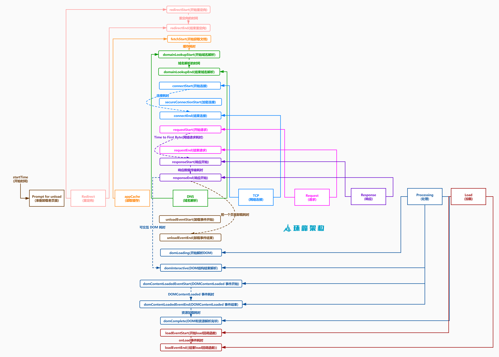

# SDK的使用

**环境：**

- 物理本机
- Wmare Centos7虚拟机A

**本次主要内容：**

- 安装和配置fee sdk，采集日志信息发送到打点服务

## 1. SDK介绍

上节课我们把打点服务部署好了，下面我们开始搭建客户端并安装SDK，然后上报数据到打点服务。

### 1.1 采集内容

- JS错误：包括JS运行时错误和未捕获的promise异常
- 资源加载错误：包括script、style、image、audio、video等资源加载错误
- 控制台抛出错误：例如控制台Vue抛错
- try...catch错误：未catch错误
- 页面各阶段加载时间：例如TTFP/FP/FCP/FMP等
    
- 用户停留时长
- 新用户数
- 设备数据
- 操作系统/设备/浏览器分布等信息

### 1.2 大致原理

sdk提供了`自动上报`和`手动上报`两种上报方式

- 我们进入`fee/sdk/src/index.js`，可以看到：

    ```js
    const feeTarget = 'https://test.com/dig' // 打点服务器，或Nginx地址
    const log = (type = '', code, detail = {}, extra = {}) => {
        // ...
        const img = new window.Image()
        img.src = `${feeTarget}?d=${encodeURIComponent(JSON.stringify(logInfo))}`
    }
    ```

    - 封装了log方法用以上报数据，上报采用img标签请求打点服务的gif资源的方式
    - **所以我们需要修改`feeTarget`为我们打点服务的地址，例如：`http://192.168.199.153:8888/dig.gif`**

    ```js
    const JS_TRACKER_ERROR_CONSTANT_MAP = {
        1: 'ERROR_RUNTIME', // 运行时错误
        2: 'ERROR_SCRIPT', // script加载错误
        3: 'ERROR_STYLE', // link加载错误
        4: 'ERROR_IMAGE', // img加载错误
        5: 'ERROR_AUDIO', // audio加载错误
        6: 'ERROR_VIDEO', // video加载错误
        7: 'ERROR_CONSOLE', // vue控制台错误
        8: 'ERROR_TRY_CATCH' // try...catch错误
    }
    ```

    - 定义了各种错误类型

- 我们进入`fee/sdk/src/js-tracker/index.js`，可以看到：

    - `window.addEventListener('error')` JS运行时错误和资源加载错误发生时自动上报
    - `window.addEventListener('unhandledrejection')` Promise异常未捕获时自动上报
    - `console.error`被重写，用以上报vue报错

- 我们回到`fee/sdk/src/index.js`：

    ```js
    window.onload = () => {
        const times = performance.timing.toJSON()
        log('perf', 20001, {
            ...times,
            url: `${window.location.host}${window.location.pathname}`
        })
    }
    ```

    - 在`onload`时页面会自动上报页面各阶段时间信息

- 继续看`fee/sdk/src/index.js`：

    ```js
    window.addEventListener('click', () => {
        const duration = now - lastTime
        // 用户在线时长
        log.product(10001, { duration_ms: duration })
    })
    ```

    - 通过监听点击事件，上报用户时长信息

    ```js
    function behavior (code = '', name = '', url = '') {
        debugLogger('发送用户点击行为埋点, 上报内容 => ', { code, name, url })
        log.product(10002, {
            code,
            name,
            url
        })
    }
    log.behavior = behavior
    ```

    - 暴露`behavior`API，可以手动上报`用户行为`信息

    ```js
    function notify (errorName = '', url = '', extraInfo = {}) {
        // ...
        return log('error', 8, detail, extra
    }
    log.notify = notify
    ```

    - 暴露`notify`API，可以手动上报`自定义错误`信息

    ```js
    log.set = (customerConfig = {}, isOverwrite = false) => {
    // 覆盖模式
    if (isOverwrite) {
        commonConfig = { ...customerConfig }
    } else {
        // lodash内置函数, 相当于递归版assign
        commonConfig = _.merge(commonConfig, customerConfig)
    }
    // ...
    ```

    - 通过暴露`set`API，初始化`SDK`配置

## 2. 新建一个demo项目

了解了SDK源码之后，我们新建一个demo项目，以测试SDK并且串起打点服务

### 2.1 首先我们编译SDK

```bash
cd fee/sdk
npm i --registry=https://registry.npm.taobao.org
npm run build
```

打包后的代码会输出到一个dist目录中。

### 2.2 新建demo项目

然后我们额外新建一个最简单的前端项目，把刚才打包的sdk文件重命名为`sdk.js`，并安装和初始化SDK：

```bash
mkdir sdk-demo
cd sdk-demo
vim index.html
```

```html
<!DOCTYPE html>
<html lang="en">

<head>
    <meta charset="UTF-8">
    <meta name="viewport" content="width=device-width, initial-scale=1.0">
    <title>SDK demo</title>
</head>

<body>
    <div id="test">测试SDK</div>
    <script src="./sdk.js"></script>
    <script>
        // 模拟uuid
        if (!localStorage.getItem('custom_UUID')) {
            const customUUID = Math.random().toString().slice(-6);
            localStorage.setItem('custom_UUID', customUUID);
        }
        window.dt && dt.set({
            pid: 'project_test_id', // [必填]项目id, 由灯塔项目组统一分配
            uuid: localStorage.getItem('custom_UUID') || '', // [可选]设备唯一id, 用于计算uv数&设备分布. 一般在cookie中可以取到, 没有uuid可用设备mac/idfa/imei替代. 或者在storage的key中存入随机数字, 模拟设备唯一id.
            ucid: '', // [可选]用户ucid, 用于发生异常时追踪用户信息, 一般在cookie中可以取到, 没有可传空字符串

            is_test: false, // 是否为测试数据, 默认为false(测试模式下打点数据仅供浏览, 不会展示在系统中)
            record: {
                time_on_page: true, // 是否监控用户在线时长数据, 默认为true
                performance: true, // 是否监控页面载入性能, 默认为true
                js_error: true, //  是否监控页面报错信息, 默认为true
                // 配置需要监控的页面报错类别, 仅在js_error为true时生效, 默认均为true(可以将配置改为false, 以屏蔽不需要上报的错误类别)
                js_error_report_config: {
                    ERROR_RUNTIME: true, // js运行时报错
                    ERROR_SCRIPT: true, // js资源加载失败
                    ERROR_STYLE: true, // css资源加载失败
                    ERROR_IMAGE: true, // 图片资源加载失败
                    ERROR_AUDIO: true, // 音频资源加载失败
                    ERROR_VIDEO: true, // 视频资源加载失败
                    ERROR_CONSOLE: true, // vue运行时报错
                    ERROR_TRY_CATCH: true, // 未catch错误
                    // 自定义检测函数, 上报前最后判断是否需要报告该错误
                    // 回调函数说明
                    // 传入参数 => 
                    //            desc:  字符串, 错误描述
                    //            stack: 字符串, 错误堆栈信息
                    // 返回值 =>  
                    //            true  : 上报打点请求
                    //            false : 不需要上报
                    checkErrrorNeedReport: function (desc, stack) {
                        return true
                    }
                }
            },

            // 业务方的js版本号, 会随着打点数据一起上传, 方便区分数据来源
            // 可以不填, 默认为1.0.0
            version: '1.0.0',

            // 对于如同
            // test.com/detail/1.html
            // test.com/detail/2.html
            // test.com/detail/3.html
            // ...
            // 这种页面来说, 虽然url不同, 但他们本质上是同一个页面
            // 因此需要业务方传入一个处理函数, 根据当前url解析出真实的页面类型(例如: 二手房列表/经纪人详情页), 以便灯塔系统对错误来源进行分类
            // 回调函数说明
            // 传入参数 => window.location
            // 返回值 => 对应的的页面类型(50字以内, 建议返回汉字, 方便查看), 默认是返回当前页面的url
            getPageType: function (location) {
                return `${location.host}${location.pathname}`
            }
        })

        // 通过点击手动创建错误
        const testDOM = document.getElementById('test');
        testDOM.addEventListener('click', function() {
            console.log(window.a.b);
        });
    </script>
</body>

</html>
```

- 我们使用了`project_test_id`作为项目id，这个项目id，到时候要和插入数据库的项目id对应上

## 3. 测试SDK

1. 启动`http-server`

    ```bash
    npm i --registry=https://registry.npm.taobao.org http-server -g
    cd /your/path/to/sdk-demo
    http-server
    ```

2. 访问`http://localhost:8080`

3. 点击文字，观察浏览器控制台是否报错，并上报了gif请求信息

    ```bash
    General
        Request URL: http://192.168.199.153:8888/dig.gif?xxxxx
        Request Method: GET
        Status Code: 200 OK
        Remote Address: 192.168.199.153:8888
    ```

4. 登录打点服务所在的虚拟机，查看是否产生符合格式的nginx日志

    ```bash
    ls /var/log/nginx/ferms
    cat /var/log/nginx/ferms/202009-01-00-00.log
    ```
