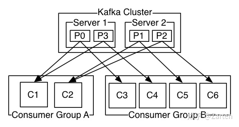

# 配置kafka和filebeat

**环境：**

- Wmare Centos7虚拟机A
- Wmare Centos7虚拟机B

**本次主要内容：**

- 配置和部署kafka
- 配置和部署filebeat，对接打点服务产生的日志和kafka服务

## 1. Kafka

- 通过前面的介绍，我们了解到kafka维护一个消息队列，负责接收`filebeat`生产的消息，并且把消息提供给消费者`task server`来消费。
- 对我们的架构来说，kafka作用之一是可以把产生日志的`nginx`和消费服务`task server`解耦开来，分别部署。

### 1.1 Kafka概念

Kafka的目标是实现：为处理实时数据提供一个统一、高吞吐、低延迟的平台。是分布式发布-订阅消息系统，是一个分布式的，可划分的，冗余备份的持久性的日志服务。

我们先耐心地了解一些枯燥的概念：

1. **kafka**：作为集群运行在一个或者多个服务器上
2. **消息**：kafka会保存消息直到它过期，无论是否被消费了。
3. kafka存储的消息是k-v键值对，k是**offset**偏移量，v就是消息的内容
4. **broker**：已发布的消息保存在一组服务器中，称之为Kafka集群。集群中的每一个服务器都是一个代理(Broker)。消费者可以订阅一个或多个主题（topic），并从Broker拉数据，从而消费这些已发布的消息。
5. **topic**：kafka将消息分门别类，每一类的消息称之为topic
6. **patition**：topic是逻辑上的概念，patition是物理概念，1个topic可以由1个或多个patition组成。1个partittion中的消息是队列形式的，每个消息被分了一个序列号offset，保证顺序。而且当性能/存储不足时Kafka就可以通过增加partition实现横向扩展
7. kafka的各个broker需要与zookeeper进行通信，每个partition的多个副本之间通过**zookeeper**的leader选举机制选出主副本。所有该Partition上的读写都通过这个主副本进行。
    
8. **producer**：发布消息的对象，往某个topic中发布消息，也负责选择发布到topic中的哪个分区
9. **consumer**：订阅消息并处理发布的消息的对象
10. **consumer group**：一个消费组由一个或多个消费者实例组成，便于扩容与容错。每一条消息只会被同一个消费组里的一个消费者实例消费，不同的消费组可以同时消费同一条消息。
    

参考链接:

- [Kafka官网](https://kafka.apache.org/)
- [Kafka入门看这一篇就够了](https://github.com/Snailclimb/JavaGuide/blob/master/docs/system-design/data-communication/Kafka%E5%85%A5%E9%97%A8%E7%9C%8B%E8%BF%99%E4%B8%80%E7%AF%87%E5%B0%B1%E5%A4%9F%E4%BA%86.md)
- [真的，Kafka入门一篇文章就够了](https://juejin.im/post/6844903495670169607)

### 1.2 配置和测试kafka

从应用的角度，我们只需要先了解其中的`consumer`、`producer`、`broker`和`topic`四个概念。
为了更好的理解上述概念，我们配置单机kafka，先做一些测试。

根据我们的规划，我们把kafka服务部署在B机器上（参见第一天的课题）

#### 1.2.1 配置zookeeper

- 登录虚拟机centos B，下载java和zookeeper

    ```bash
    cd /home/admin
    # java
    yum install java-11-openjdk-devel -y
    # zookeeper
    wget http://mirror.bit.edu.cn/apache/zookeeper/zookeeper-3.6.2/apache-zookeeper-3.6.2-bin.tar.gz
    ```

- 解压后进入目录

    ```bash
    tar -zxvf apache-zookeeper-3.6.2-bin.tar.gz
    cd apache-zookeeper-3.6.2-bin/conf
    ```

- 复制zookeeper的配置文件

    ```bash
    cp zoo_sample.cfg zoo.cfg
    ```

- 开启zookeeper

    ```bash
    ./bin/zkServer.sh start
    ```

- 查看zookeeper是否成功开启

    ```bash
    netstat -tunlp | egrep 2181
    ```

#### 1.2.2 配置kafka

- [选择一款kafka，复制下载地址](http://mirror.bit.edu.cn/apache/kafka/)

    ```bash
    cd /home/admin
    wget http://mirror.bit.edu.cn/apache/kafka/2.6.0/kafka_2.13-2.6.0.tgz
    ```

- 解压后进入config目录

    ```bash
    tar -zxvf kafka_2.13-2.6.0.tgz
    cd kafka_2.13-2.6.0/config
    ```

- 配置`kafka server`的`listeners`为本机ip

    ```bash
    # vim server.properties
    listeners=PLAINTEXT://192.168.199.101:9092
    advertised.listeners=PLAINTEXT://192.168.199.101:9092
    ```

- 开启kafka服务，会开启一个本机IP+9092端口的服务

    ```bash
    cd ../bin
    ./kafka-server-start.sh ./../config/server.properties 1>/dev/null 2>&1 &
    ```

#### 1.2.3 测试kafka的producer和consumer

- 开始消费，会自动创建名称为fee的topic：

    ```bash
    ./kafka-console-consumer.sh --bootstrap-server 192.168.199.101:9092 --topic fee --from-beginning
    ```

- 重新开一个窗口，cd到kafka目录/bin下，开始生产消息

    ```bash
    ./kafka-console-producer.sh --broker-list 192.168.199.101:9092 --topic fee
    > A awesome message from me!
    ```

- 我们回到消费的窗口，会发现命令行打印出了消息`A awesome message from me!`

- 这样我们就对kafka就有了一直相对直观的了解，最后我们使用`control + c`快捷键把producer和consumer都取消。

参考链接:

- [Kafka 概念、单机搭建与使用](https://www.cnblogs.com/primadonna/p/10476663.html)

## 2. Filebeat

`filebeat`会作为`producer`将nginx产生的日志作为消息发送到`kafka`

### 2.1 Filebeat概念

- filebeat是一个日志文件托运工具，在你的服务器上安装客户端后，filebeat会监控日志目录或者指定的日志文件，追踪读取这些文件（追踪文件的变化，不停的读），并且转发这些信息到elasticsearch或者logstarsh或者kafka等。

### 2.2 测试filebeat

**环境：**

- win10物理机
- Wmare Centos7虚拟机A

根据我们的规划，我们把filebeat工具部署在A机器上（参见第一天的课题）

#### 2.2.1 下载和安装filebeat

- 下载和安装GPG公钥

    ```bash
    sudo rpm --import https://packages.elastic.co/GPG-KEY-elasticsearch
    ```

- 在`/etc/yum.repos.d/`目录下，创建一个`elastic.repo`文件，并且添加以下行

    ```bash
    [elastic-7.x]
    name=Elastic repository for 7.x packages
    baseurl=https://artifacts.elastic.co/packages/7.x/yum
    gpgcheck=1
    gpgkey=https://artifacts.elastic.co/GPG-KEY-elasticsearch
    enabled=1
    autorefresh=1
    type=rpm-md
    ```

- 安装filebeat

    ```bash
    sudo yum install filebeat -y
    ```

- Filebeat默认目录

    - 安装目录为：`/usr/share/filebeat`
    - 配置文件所在目录为：`/etc/filebeat/filebeat.yml`

#### 2.2.2 Filebeat配置

```bash
vim /etc/filebeat/filebeat.yml
```

1. 如果是老版本filebeat，`filebeat.inputs`的字段名称会是`filebeat.prospectors`，启动会报错：`Exiting: 1 error: setting 'filebeat.prospectors' has been removed`，故修改为：

    ```bash
    # ============================== Filebeat inputs ===============================
    # 把filebeat.prospectors:
    # 修改为
    filebeat.inputs:
    ```

2. 配置`filebeat.inputs`的`enabled`为`true`

3. 配置`filebeat.inputs`的`paths`为`nginx日志文件路径`

    ```bash
    # ============================== Filebeat inputs ===============================
    filebeat.inputs:
    - type: log
    enabled: true
    paths:
        - /var/log/nginx/ferms/*.log
    ```

4. 配置`output.kafka`的`hosts`和`topic`

    ```bash
    # ================================== Outputs ===================================

    output.kafka:
        hosts: ["192.168.199.101:9092"]
        topic: "fee"
    ```

5. Filebeat需要把一些无用的fields字段删除：

    ```bash
    # ================================= Processors =================================
    processors:
    - drop_fields:
        fields: ["@timestamp", "@metadata", "log", "input", "ecs", "host", "agent"]
    ```

    `drop_fields`具体配置参见[官网](https://www.elastic.co/guide/en/beats/filebeat/current/drop-fields.html)

6. Filebeat详细配置如下：

    ```yml
    ###################### Filebeat Configuration Example #########################

    # This file is an example configuration file highlighting only the most common
    # options. The filebeat.reference.yml file from the same directory contains all the
    # supported options with more comments. You can use it as a reference.
    #
    # You can find the full configuration reference here:
    # https://www.elastic.co/guide/en/beats/filebeat/index.html

    # For more available modules and options, please see the filebeat.reference.yml sample
    # configuration file.

    # ============================== Filebeat inputs ===============================

    filebeat.inputs:

    # Each - is an input. Most options can be set at the input level, so
    # you can use different inputs for various configurations.
    # Below are the input specific configurations.

    - type: log

    # Change to true to enable this input configuration.
    enabled: true

    # Paths that should be crawled and fetched. Glob based paths.
    paths:
        - /var/log/nginx/ferms/*.log
        #- c:\programdata\elasticsearch\logs\*

    # Exclude lines. A list of regular expressions to match. It drops the lines that are
    # matching any regular expression from the list.
    #exclude_lines: ['^DBG']

    # Include lines. A list of regular expressions to match. It exports the lines that are
    # matching any regular expression from the list.
    #include_lines: ['^ERR', '^WARN']

    # Exclude files. A list of regular expressions to match. Filebeat drops the files that
    # are matching any regular expression from the list. By default, no files are dropped.
    #exclude_files: ['.gz$']

    # Optional additional fields. These fields can be freely picked
    # to add additional information to the crawled log files for filtering
    #fields:
    #  level: debug
    #  review: 1

    ### Multiline options

    # Multiline can be used for log messages spanning multiple lines. This is common
    # for Java Stack Traces or C-Line Continuation

    # The regexp Pattern that has to be matched. The example pattern matches all lines starting with [
    #multiline.pattern: ^\[

    # Defines if the pattern set under pattern should be negated or not. Default is false.
    #multiline.negate: false

    # Match can be set to "after" or "before". It is used to define if lines should be append to a pattern
    # that was (not) matched before or after or as long as a pattern is not matched based on negate.
    # Note: After is the equivalent to previous and before is the equivalent to to next in Logstash
    #multiline.match: after

    # ============================== Filebeat modules ==============================

    filebeat.config.modules:
    # Glob pattern for configuration loading
    path: ${path.config}/modules.d/*.yml

    # Set to true to enable config reloading
    reload.enabled: false

    # Period on which files under path should be checked for changes
    #reload.period: 10s

    # ======================= Elasticsearch template setting =======================

    setup.template.settings:
    index.number_of_shards: 3
    #index.codec: best_compression
    #_source.enabled: false


    # ================================== General ===================================

    # The name of the shipper that publishes the network data. It can be used to group
    # all the transactions sent by a single shipper in the web interface.
    #name:

    # The tags of the shipper are included in their own field with each
    # transaction published.
    #tags: ["service-X", "web-tier"]

    # Optional fields that you can specify to add additional information to the
    # output.
    #fields:
    #  env: staging

    # ================================= Dashboards =================================
    # These settings control loading the sample dashboards to the Kibana index. Loading
    # the dashboards is disabled by default and can be enabled either by setting the
    # options here or by using the `setup` command.
    #setup.dashboards.enabled: false

    # The URL from where to download the dashboards archive. By default this URL
    # has a value which is computed based on the Beat name and version. For released
    # versions, this URL points to the dashboard archive on the artifacts.elastic.co
    # website.
    #setup.dashboards.url:

    # =================================== Kibana ===================================

    # Starting with Beats version 6.0.0, the dashboards are loaded via the Kibana API.
    # This requires a Kibana endpoint configuration.
    setup.kibana:

    # Kibana Host
    # Scheme and port can be left out and will be set to the default (http and 5601)
    # In case you specify and additional path, the scheme is required: http://localhost:5601/path
    # IPv6 addresses should always be defined as: https://[2001:db8::1]:5601
    #host: "localhost:5601"

    # Kibana Space ID
    # ID of the Kibana Space into which the dashboards should be loaded. By default,
    # the Default Space will be used.
    #space.id:

    # =============================== Elastic Cloud ================================

    # These settings simplify using Filebeat with the Elastic Cloud (https://cloud.elastic.co/).

    # The cloud.id setting overwrites the `output.elasticsearch.hosts` and
    # `setup.kibana.host` options.
    # You can find the `cloud.id` in the Elastic Cloud web UI.
    #cloud.id:

    # The cloud.auth setting overwrites the `output.elasticsearch.username` and
    # `output.elasticsearch.password` settings. The format is `<user>:<pass>`.
    #cloud.auth:

    # ================================== Outputs ===================================

    # Configure what output to use when sending the data collected by the beat.

    output.kafka:
        hosts: ["xxx.xxx.xxx.xxx:9092","yyy.yyy.yyy.yyy:9092","zzz.zzz.zzz.zzz:9092"]
        topic: "fee"

    # ---------------------------- Elasticsearch Output ----------------------------
    #output.elasticsearch:
    # Array of hosts to connect to.
    #hosts: ["localhost:9200"]

    # Protocol - either `http` (default) or `https`.
    #protocol: "https"

    # Authentication credentials - either API key or username/password.
    #api_key: "id:api_key"
    #username: "elastic"
    #password: "changeme"

    # ------------------------------ Logstash Output -------------------------------
    #output.logstash:
    # The Logstash hosts
    #hosts: ["localhost:5044"]

    # Optional SSL. By default is off.
    # List of root certificates for HTTPS server verifications
    #ssl.certificate_authorities: ["/etc/pki/root/ca.pem"]

    # Certificate for SSL client authentication
    #ssl.certificate: "/etc/pki/client/cert.pem"

    # Client Certificate Key
    #ssl.key: "/etc/pki/client/cert.key"

    # ================================= Processors =================================
    processors:
    - drop_fields:
        fields: ["@timestamp", "@metadata", "log", "input", "ecs", "host", "agent"]

    # ================================== Logging ===================================

    # Sets log level. The default log level is info.
    # Available log levels are: error, warning, info, debug
    # logging.level: debug

    # At debug level, you can selectively enable logging only for some components.
    # To enable all selectors use ["*"]. Examples of other selectors are "beat",
    # "publish", "service".
    #logging.selectors: ["*"]

    # ============================= X-Pack Monitoring ==============================
    # Filebeat can export internal metrics to a central Elasticsearch monitoring
    # cluster.  This requires xpack monitoring to be enabled in Elasticsearch.  The
    # reporting is disabled by default.

    # Set to true to enable the monitoring reporter.
    #monitoring.enabled: false

    # Sets the UUID of the Elasticsearch cluster under which monitoring data for this
    # Filebeat instance will appear in the Stack Monitoring UI. If output.elasticsearch
    # is enabled, the UUID is derived from the Elasticsearch cluster referenced by output.elasticsearch.
    #monitoring.cluster_uuid:

    # Uncomment to send the metrics to Elasticsearch. Most settings from the
    # Elasticsearch output are accepted here as well.
    # Note that the settings should point to your Elasticsearch *monitoring* cluster.
    # Any setting that is not set is automatically inherited from the Elasticsearch
    # output configuration, so if you have the Elasticsearch output configured such
    # that it is pointing to your Elasticsearch monitoring cluster, you can simply
    # uncomment the following line.
    #monitoring.elasticsearch:

    # ============================== Instrumentation ===============================

    # Instrumentation support for the filebeat.
    #instrumentation:
        # Set to true to enable instrumentation of filebeat.
        #enabled: false

        # Environment in which filebeat is running on (eg: staging, production, etc.)
        #environment: ""

        # APM Server hosts to report instrumentation results to.
        #hosts:
        #  - http://localhost:8200

        # API Key for the APM Server(s).
        # If api_key is set then secret_token will be ignored.
        #api_key:

        # Secret token for the APM Server(s).
        #secret_token:


    # ================================= Migration ==================================

    # This allows to enable 6.7 migration aliases
    #migration.6_to_7.enabled: true
    ```

#### 2.2.3 filebeat启动、状态和停止

- 设置启动和开机启动：

    ```bash
    # 启动
    systemctl start filebeat.service
    # 开机启动
    systemctl enable filebeat.service
    ```

- 如果遇到问题，可以运行状态和停止命令：

    ```bash
    # 状态
    systemctl status filebeat.service
    # 停止
    systemctl stop filebeat.service
    ```

#### 2.2.4 Filebeat测试

- 我们在浏览器访问dig服务`http://192.168.153.199:8888/dig.gif?a=1`

- 开启一个消费者

    ```bash
    ./kafka-console-consumer.sh --bootstrap-server=192.168.153.199:9092 --topic fee --from-beginning
    ```

- 查看kafka是否接收到的消息：

    ```json
    {
        "@timestamp": "2020-07-17T06:52:48.899Z",
        "@metadata": {
            "beat": "filebeat",
            "type": "_doc",
            "version": "7.8.0"
        },
        "ecs": {
            "version": "1.5.0"
        },
        "host": {
            "name": "high-52"
        },
        "log": {
            "offset": 0,
            "file": {
                "path": "/etc/nginx/logs/dig-log/202007-17-14-52.log"
            }
        },
        "message": "17/Jul/2020:14:52:41 +0800                      -       -       - xxx.xxx.com  304 0.000 594 0      15d04347-be16-b9ab-0029-24e4b6645950    -       -       9689c3ea-5155-2df7-a719-e90d2dedeb2c 937ba755-116a-18e6-0735-312cba23b00c    GET /dig.gif?a=iAmAMessageFromBrowser HTTP/1.1  -       Mozilla/5.0 (Macintosh; Intel Mac OS X 10_15_5) AppleWebKit/537.36 (KHTML, like Gecko) Chrome/83.0.4103.116 Safari/537.36     -       sample=-&_UC_agent=-&lianjia_device_id=-&-      -       -       -",
        "input": {
            "type": "log"
        },
        "agent": {
            "id": "5d6667a6-31eb-48e4-b9a5-0881c38a00d0",
            "name": "high-52",
            "type": "filebeat",
            "version": "7.8.0",
            "hostname": "high-52",
            "ephemeral_id": "3e8701c7-a37a-47d6-9469-267aec61ea0b"
        }
    }
    ```

#### 2.2.5 Filebeat常见问题

1. 当碰到问题，可以配置日志级别为debug，查看详细日志

    ```bash
    # vim /etc/filebeat/filebeat.yml
    logging.level: debug
    ```

    ```bash
    tail -f  /var/lib/filebeat/registry/filebeat/log.json
    ```

至此，filebeat和kafka我们就部署好了。我们可以看到一旦打点服务nginx产生了新的日志，会被filebeat监控到，然后上报到kafka消息队列。

参考链接:

- [filebeat官网](https://www.elastic.co/cn/beats/filebeat)
- [filebeat配置kafka官网](https://www.elastic.co/guide/en/beats/filebeat/master/kafka-output.html)
- [Filebeat 采集日志到 Kafka 配置及使用](https://lihuimintu.github.io/2019/08/05/Filebeat-Kafka/)
