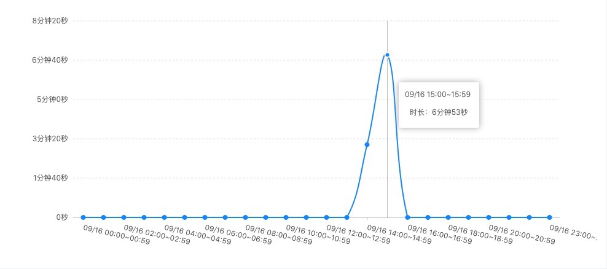
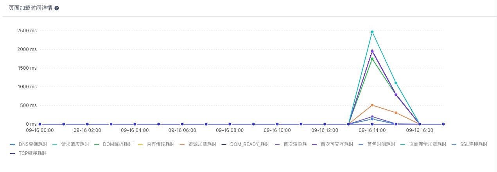
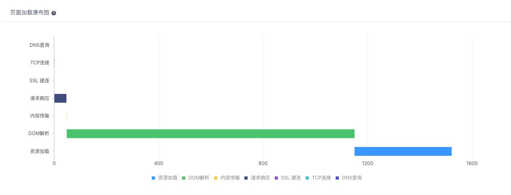
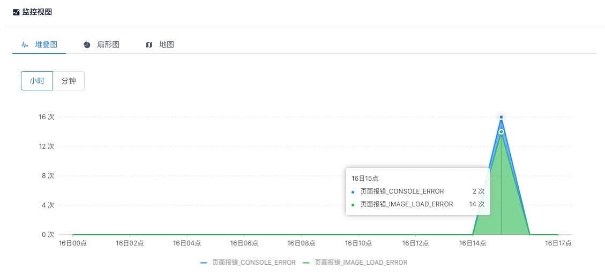
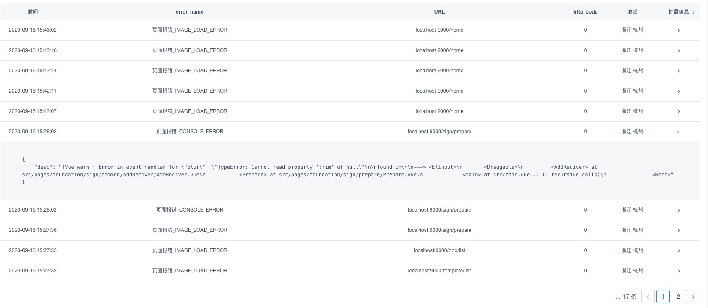

# 部署client部分，串起整体流程

**环境：**

- win10物理机
- Wmare Centos7虚拟机C

**本次主要内容：**

- 部署client可视化展示部分

## 1. Client

Client端会对消费、聚合后的数据做直观的可视化展示

### 1.1 修改`fee-client`

- 在物理机本地的fee项目中，配置ajax请求前缀

    ```js
    // client\config\url.js
    const PRO_URL = '/server-api'
    ```

### 1.2 安装`fee-client`依赖

- 在物理机本地的fee项目中，cd到client，安装依赖

    ```bash
    npm i --registry=https://registry.npm.taobao.org
    ```

- 编译client

    ```bash
    npm run build
    ```

### 1.3 部署`fee-client`

- 在虚拟机A新建目录

    ```bash
    mkdir -p /home/admin/fee-client
    ```

- 把刚才编译好的dist目录发送到虚拟机A的`/home/admin/fee-client`目录

    ```bash
    scp -r dist/* root@192.168.199.153:/home/admin/fee-client
    ```

### 1.4 配置和重启nginx

- 在虚拟机A配置nginx

    ```shell
    # /etc/nginx/nginx.conf
     server {
        listen       3333;
        server_name  fee-client;
        location / {
            root /home/admin/fee-client;
            try_files $uri /index.html;
        }
        location /server-api/ {
            proxy_pass http://192.168.199.217:3000/;
        }
    }
    ```

- 重启nginx

    ```bash
    systemctl restart nginx
    ```

### 1.5 注册client用户

- 浏览器访问client `http://192.168.199.153:3333/`

- 注册一个账号

### 1.6 修改fee数据库

- 在虚拟机C，进入fee数据库

    ```bash
    mysql -u root -p
    # 密码qweQWE123!@#
    use fee
    ```

- 修改`t_o_user`表中，刚才注册账号的role字段

    ```shell
    UPDATE `fee`.`t_o_user` SET `role` = 'owner' WHERE `id` = 1
    ```

### 1.6 访问client

- 访问`http://localhost:8080/`，手动制造一些错误

- 浏览器访问`http://192.168.199.153:3333/`，我们可以看到可视化客户端，菜单包括

    - 用户行为

        - 菜单点击量
        - 用户在线时长
            
        - 新增用户数据

    - 异常监控

        - 页面性能
            
            
        - 错误看板
            
            

    - 报警

        - 配置
        - 日志

- 我们可以查看各个环节日志，确认各个环节运行无异常
- 过几分钟，我们可以看到刚刚采集到的页面性能和错误等信息
- 至此，前端监控整体的流程已经全部串起来了
- fee目前已经发布了V2版本，功能和架构更加完善，有条件的同学可以尝试研究
- [灯塔V2 github地址](https://github.com/LianjiaTech/fee/tree/dev)
